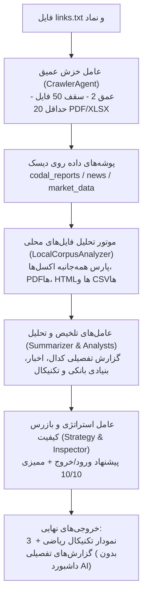

# سند طراحی فنی: خزشگر عمیق، تحلیل جامع فایل‌های محلی و استانداردسازی مصورسازی

> **تاریخ:** 2026-08-29  
> **موضوع:** خزش چندمرحله‌ای لینک‌ها، استخراج و تحلیل کلیه فایل‌های محلی (اکسل، PDF، HTML) و حذف داشبورد هوش مصنوعی  
> **نویسنده و توسعه دهنده:** `alimohammadzadeh@ut.ac.ir`  
> **پروژه:** سامانه تحلیل چندعاملی بازار سرمایه ایران (IRStockMarketAnalyzer)

---

## ۱. اهداف و نیازمندی‌ها (Goals & Requirements)

### ۱.۱. اهداف اصلی:
1. **خزش عمیق و چندمرحله‌ای (Deep Multi-Hop Crawler):**
   - پیمایش دو‌مرحله‌ای (عمق = ۲) برای تمامی پیوندهای درج‌شده در فایل `links.txt`.
   - استخراج لینک صفحات فرعی (اطلاعیه‌ها، اخبار، تحلیل‌ها) و دانلود فایل‌های ارجاع‌شده در آن‌ها.
   - اعمال سقف حداکثر ۵۰ فایل دانلودی در هر اجرا.
   - تضمین دانلود حداقل ۲۰ گزارش مالی اخیر سهام با فرمت رسمی **PDF یا XLSX/XLS**.
2. **موتور تحلیل جامع اسناد و فایل‌های محلی (`LocalCorpusAnalyzer`):**
   - اسکن و خواندن تمامی فایل‌های موجود در پوشه سهم و کلیه زیرپوشه‌ها (`codal_reports/`، `news/`، `market_data/`).
   - استخراج جداول مالی ترازنامه و سود و زیان از فایل‌های اکسل (`.xlsx/.xls`).
   - استخراج متن گزارش‌های رسمی، بندهای حسابرس و مجامع از فایل‌های `.pdf`.
   - استخراج محتوای متنی و رویدادهای کلیدی از فایل‌های `.html` و اخبار.
   - استخراج شاخص‌های بازار و قدرت خریدار از فایل‌های `.csv` و `.json`.
   - تغذیه خروجی استخراج‌شده به عامل‌های خلاصه‌ساز (`SummarizerAgent`) و بنیادی (`FundamentalAnalystAgent`).
3. **حذف قطعی داشبورد هوش مصنوعی (Elimination of AI Dashboard):**
   - حذف کامل هرگونه تصویرسازی با مدل‌های مولد تصویر (Nano Banana Pro / Gemini Image Generation) به دلیل خطای ارقام و توهم عددی.
   - حذف فایل‌های `ai_dashboard.png` از کلیه پوشه‌ها و الگوهای گزارش.
   - تکیه ۱۰۰٪ بر ۳ نمودار تکنیکال ریاضی مبتنی بر دیتای واقعی TSETMC با تایپوگرافی پیوسته فارسی.

---

## ۲. معماری و جریان داده سیستم (Architecture & Data Flow)

---

## ۳. مشخصات تفصیلی مؤلفه‌ها (Component Specifications)

### ۳.۱. خزشگر عمیق (`src/agents/crawler.py` و ماژول بازگشتی)
- **ورودی:** مسیر دایرکتوری سهم و فایل `links.txt`.
- **مرحله ۱ (صفحات مبدا):**
  - خواندن آدرس‌های `links.txt` (شامل رهاورد ۳۶۵، بورس ۲۴، کدال، انیگما، سنا و ...).
  - دانلود صفحه مبدا با `trust_env=False` و هدرهای استاندارد.
- **مرحله ۲ (صفحات داخلی و فایل‌ها):**
  - استخراج تمامی تگ‌های `<a href="...">` دارای پیوند به فایل‌های سندی یا مقالات داخلی.
  - ساخت آدرس‌های مطلق با `urllib.parse.urljoin`.
  - فیلتر کردن فایل‌های مورد نیاز بر اساس پسوند:
    * اسناد کدال: `.pdf`, `.xls`, `.xlsx`, `.htm`, `.html`
    * اخبار و مقالات: صفحات داخلی گزارش‌های خبری با ساختار `/news/\d+` یا عناوین مرتبط با سهم.
- **کنترل صف دانلود (Queue & Quota Management):**
  - شمارنده کل فایل‌ها: حداکثر ۵۰ فایل.
  - سهمیه فرمت‌های رسمی: تا زمانی که حداقل ۲۰ فایل `pdf` یا `xlsx/xls` دانلود نشود، اولویت با لینک‌های دانلود فایل مستقیم کدال (`DownloadFile.aspx` و `excel.codal.ir`) است.
  - ذخیره‌سازی در مسیرهای معین:
    * فایل‌های مالی و صورت‌ها $\rightarrow$ `codal_reports/`
    * فایل‌های اخبار و مقالات $\rightarrow$ `news/`
    * دیتای معاملات و تابلو $\rightarrow$ `market_data/`

### ۳.۲. موتور تحلیل فایل‌های محلی (`src/data/corpus_analyzer.py`)
این کلاس جدید (`LocalCorpusAnalyzer`) مستقل از وب و صرفاً بر روی فایل‌های دیسک عمل می‌کند:
- **متد `scan_and_analyze(symbol_dir: Path) -> CorpusAnalysisResult`:**
  - **پردازش اکسل:** خواندن تمام فایل‌های `*.xls` و `*.xlsx` در `codal_reports/`. استخراج برچسب‌ها و مبالغ سرفصل‌های «درآمدهای عملیاتی»، «سود خالص»، «مجموع دارایی‌ها»، «سپرده‌ها» و «تسهیلات اعطایی».
  - **پردازش پی‌دی‌اف:** خواندن فایل‌های `*.pdf` با `pypdf` و استخراج بندهای شرطی حسابرس و مصوبات مجمع.
  - **پردازش گزارش‌های HTML و متنی:** استخراج سرفصل‌ها و توضیحات تکمیلی گزارش‌های ماهانه و متن خبرهای دانلودشده در `news/`.
  - **پردازش داده‌های بازار:** پردازش `trade_history.csv` و `orderbook_tape.json`.
- **ساختار خروجی `CorpusAnalysisResult`:**
  - دیکشنری کاملی از ارقام استخراج‌شده، خلاصه نکات صورت‌های مالی، سنتیمنت اخبار، و شاخص‌های آماری معاملات.

### ۳.۳. عامل‌های تلخیص، تحلیل و تدوین استراتژی
- **`SummarizerAgent`:**
  - با دریافت خروجی `LocalCorpusAnalyzer`، گزارش‌های `codal_summaries.md` و `news_summary.md` را با جزئیات عمیق و اتکا به تمام فایل‌های اکسل، PDF و HTML تولید می‌کند.
- **`FundamentalAnalystAgent`:**
  - نسبت‌های مالی (P/E، حاشیه سودها، رشد سپرده‌ها و تسهیلات) را مستقیماً از داده‌های اکسل و متون PDF محاسبه و در `fundamental_report.md` درج می‌کند.
- **`TechnicalAnalystAgent`:**
  - تولید ۳ نمودار ریاضی با داده‌های قطعی TSETMC:
    1. `candlestick_overview.png`
    2. `indicators_momentum.png`
    3. `tape_reading_money_flow.png`
  - هیچ ارجاعی به `ai_dashboard.png` در متن گزارش قرار نمی‌گیرد.

---

## ۴. استانداردهای مصورسازی و صحت داده‌ها (Visual & Data Integrity)
1. کلیه توابع یا ارجاعات به ابزار تولید تصویر با هوش مصنوعی حذف می‌گردد.
2. هیچ عددی در نمودارها تخمینی یا تولیدشده توسط هوش مصنوعی نخواهد بود.
3. تمامی نمودارها صرفاً از روی دیتای `trade_history.csv` با متدهای استاندارد `matplotlib` رسم می‌شوند.
4. خطوط فارسی در نمودارها با فونت‌های استاندارد سیستم (`Tahoma`, `Segoe UI`) بدون معکوس‌شدگی یا جدایی حروف رسم می‌شوند.

---

## ۵. راهبرد آزمون (Testing Strategy)
1. **تست واحد خزشگر عمیق (`tests/test_crawler_agent.py`):**
   - راستی‌آزمایی عمق ۲ در پیمایش لینک‌ها.
   - راستی‌آزمایی سقف ۵۰ فایل دانلودی و حداقل ۲۰ فایل PDF/XLSX.
2. **تست واحد موتور تحلیل اسناد محلی (`tests/test_corpus_analyzer.py`):**
   - تست خواندن فایل اکسل آزمایشی و استخراج ارقام مالی.
   - تست پارس فایل‌های HTML و PDF ساختگی و استخراج نکات.
3. **تست صحت پایپ‌لاین و گزارش‌ها (`tests/test_reporting.py` و `tests/test_inspector_agent.py`):**
   - تضمین عدم وجود و عدم نیاز به `ai_dashboard.png`.
   - تست امتیازدهی بازرس کیفیت به خروجی‌های جدید (نمره ۱۰ از ۱۰).
4. **اجرای کامل تست‌های رگرسیون:**
   - پاس شدن تمام تست‌های موجود به همراه تست‌های جدید با `python -m pytest`.
5. **تست اعتبارسنجی عملی روی نماد وتجارت:**
   - اجرای کامل پایپ‌لاین، بازبینی پوشه‌ها و گزارش‌ها.
