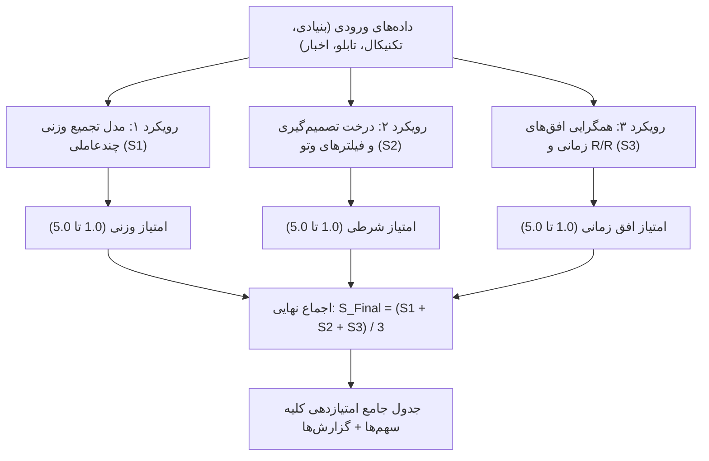

# سند طراحی فنی: سیستم جامع سه‌گانه امتیازدهی توصیه به خرید/فروش (مقیاس ۱ تا ۵)

## ۱. هدف و صورت مسئله
هدف این سند، طراحی و پیاده‌سازی یک شاخص امتیازی واحد و چندلایه با مقیاس **۱ تا ۵** جهت ارائه «توصیه به خرید یا فروش» برای هر نماد بر مبنای تجمیع کلیه داده‌های استخراج‌شده (صورت‌های مالی، ترازنامه، گزارش‌های ماهانه، سوابق معاملاتی، اسیلاتورهای تکنیکال، تابلوخوانی حقیقی/حقوقی و جریان نقدینگی) است.

بر اساس نیاز پروژه، **هر ۳ رویکرد تحلیلی** به صورت هم‌زمان پیاده‌سازی شده و نتایج آن‌ها در قالب یک جدول مقایسه‌ای جامع برای تمامی نمادها همراه با تشریح شفاف مبانی محاسباتی در اسناد نهایی ذخیره می‌گردند.

---

## ۲. تعریف استاندارد مقیاس امتیازدهی ۱ تا ۵

| امتیاز | نماد و عنوان | دامنه عددی اجماع | تعریف و مفهوم معاملاتی |
| :---: | :--- | :---: | :--- |
| **۱** | 🔴 **فروش قاطع و خروج (Strong Sell)** | ۱.۰ تا ۱.۴ | ریسک بسیار بالا، شکست حمایت‌های ماژور، ارزندگی منفی یا خروج سنگین نقدینگی |
| **۲** | 🟠 **کاهش حجم / فروش پله‌ای (Sell / Reduce)** | ۱.۵ تا ۲.۴ | تضعیف مومنتوم، اشباع خرید شدید بدون پشتوانه بنیادی یا ریسک بالای اصلاح |
| **۳** | 🟡 **نگهداری / نظاره‌گر (Hold / Neutral)** | ۲.۵ تا ۳.۴ | تعادل عرضه و تقاضا، فاز نوسانی رنج، قیمت تعادلی منصفانه (Fair Value) |
| **۴** | 🟢 **خرید / ورود پله‌ای (Buy / Accumulate)** | ۳.۵ تا ۴.۴ | ارزندگی بنیادی مناسب، روند تکنیکال مساعد، برتری نسبی خریداران حقیقی |
| **۵** | 🚀 **خرید قاطع / فرصت طلایی (Strong Buy)** | ۴.۵ تا ۵.۰ | همگرایی کامل بنیادی، تکنیکال صعودی، ورود پرقدرت پول هوشمند و کاتالیزورهای قوی |

---

## ۳. فرمول‌ها و معماری محاسباتی ۳ رویکرد

---

### 🔹 رویکرد اول: مدل تجمیع وزنی چندعاملی ($S_1$)
امتیاز بر پایه میانگین وزنی نرمال‌شده ۴ رکن اصلی محاسبه می‌شود:

$$S_1 = 1.0 + 4.0 \times \left( 0.35 \times \frac{S_{\text{Fund}}}{10} + 0.30 \times \frac{S_{\text{Tech}}}{10} + 0.25 \times \frac{S_{\text{Tape}}}{10} + 0.10 \times \frac{S_{\text{News}}}{10} \right)$$

* **نمره بنیادی ($S_{\text{Fund}}$ - بین ۰ تا ۱۰):** ضریب P/E نسبت به صنعت، حاشیه سود ناخالص/خالص، نسبت P/NAV، رشد فروش ماهانه و وضعیت سود انباشته.
* **نمره تکنیکال ($S_{\text{Tech}}$ - بین ۰ تا ۱۰):** موقعیت قیمت نسبت به EMA 20/50/200، ابر کومو ایچیموکو، اسیلاتور RSI و واگرایی‌های مثبت/منفی.
* **نمره تابلوخوانی ($S_{\text{Tape}}$ - بین ۰ تا ۱۰):** نسبت قدرت خریدار حقیقی (Buyer Power) و حجم معاملات روزانه نسبت به میانگین ۲۰ روزه.
* **نمره اخبار و سنتیمنت ($S_{\text{News}}$ - بین ۰ تا ۱۰):** اطلاعیه‌های بااهمیت الف/ب، افزایش سرمایه و اخبار مجامع.

---

### 🔹 رویکرد دوم: مدل درخت تصمیم‌گیری و فیلترهای مشروط وتوکننده ($S_2$)
سهم از یک سری گیت‌های منطقی و شروط وتوکننده عبور می‌کند:
1. **قوانین وتوی ریسک (Veto Rules):**
   - اگر قیمت زیر حد ضرر تثبیت شود یا RSI بالای ۸۵ با واگرایی منفی سقف‌ها باشد $\to$ سقف امتیاز حداکثر **۲.۰ یا ۱.۰** است.
   - اگر شرکت مشمول ماده ۱۴۱ با زیان انباشته فزاینده بدون کاتالیزور افزایش سرمایه باشد $\to$ سقف امتیاز برابر با **۲.۰** است.
2. **شرط کسب امتیاز ۵.۰ (خرید قاطع):**
   - $S_{\text{Fund}} \ge 8.0$ و قیمت بالاتر از EMA 20 و قدرت خریدار حقیقی $\ge 1.5$ و نسبت ریسک به ریوارد $\ge 2.0$.
3. **شرط کسب امتیاز ۴.۰ (خرید پله‌ای):**
   - $S_{\text{Fund}} \ge 6.0$ و روند صعودی/خنثی و قدرت خریدار حقیقی $\ge 1.1$.
4. **شرط کسب امتیاز ۳.۰ (نگهداری):**
   - سهم در محدوده قیمت منصفانه و تعادل عرضه و تقاضا بدون سیگنال نقض‌کننده روند.
5. **شرط کسب امتیاز ۲.۰ یا ۱.۰ (کاهش حجم / فروش):**
   - شکست سطوح حمایتی، برتری سنگین فروشندگان یا عدم ارزندگی بنیادی.

---

### 🔹 رویکرد سوم: مدل همگرایی افق‌های زمانی و کیفیت ریسک به ریوارد ($S_3$)
ابتدا امتیاز ۳ افق زمانی مجزا ارزیابی می‌شود:
* **افق کوتاه‌مدت ($H_{\text{ST}}$ - وزن ۳۵٪):** تابلوخوانی و قدرت خریدار (۵۰٪) + اسیلاتور مومنتوم RSI (۵۰٪).
* **افق میان‌مدت ($H_{\text{MT}}$ - وزن ۳۵٪):** روند میانگین‌های متحرک (۵۰٪) + رشد فروش ماهانه کدال (۵۰٪).
* **افق بلندمدت ($H_{\text{LT}}$ - وزن ۳۰٪):** ارزندگی بنیادی، P/NAV، سود تقسیمی DPS و ارزش جایگزینی (۱۰۰٪).

سپس ضریب کیفیت نسبت ریسک به ریوارد ($Q_{\text{RR}}$) اعمال می‌گردد:
* اگر $R/R \ge 2.0 \to Q_{\text{RR}} = 1.10$ (تقویت امتیاز)
* اگر $1.5 \le R/R < 2.0 \to Q_{\text{RR}} = 1.00$ (خنثی)
* اگر $R/R < 1.5 \to Q_{\text{RR}} = 0.85$ (تعدیل منفی نمره به دلیل عدم جذابیت بازدهی به ریسک)

$$S_3 = \text{clamp}\left( 1.0 + 4.0 \times \left( 0.35 H_{\text{ST}} + 0.35 H_{\text{MT}} + 0.30 H_{\text{LT}} \right) \times Q_{\text{RR}}, 1.0, 5.0 \right)$$

---

### 🌟 اجماع نهایی (Composite Score)
$$S_{\text{Final}} = \text{round}\left( \frac{S_1 + S_2 + S_3}{3}, 1 \right)$$

---

## ۴. جدول جامع مقایسه‌ای امتیازدهی کلیه نمادهای تحلیل‌شده در سامانه

| ردیف | نماد | نام شرکت / صندوق | رویکرد ۱ (تجمیع وزنی) | رویکرد ۲ (درخت تصمیم) | رویکرد ۳ (افق‌ها و R/R) | امتیاز نهایی (۱ تا ۵) | سیگنال نهایی | مبنا و منطق اصلی محاسبات |
| :---: | :---: | :--- | :---: | :---: | :---: | :---: | :---: | :--- |
| ۱ | **تابان** | گروه پتروشیمی تابان فردا | **۴.۸** | **۵.۰** | **۴.۹** | **۴.۹ از ۵ (★★★★★)** | **🚀 خرید قاطع (Strong Buy)** | نسبت P/NAV حدود ۴۰٪، تخفیف ۶۰٪ در عرضه اولیه، حداقل بازدهی تضمین‌شده ۴۰٪ سالانه |
| ۲ | **کلید** | صندوق املاک و مستغلات کلید | **۴.۳** | **۴.۰** | **۴.۳** | **۴.۲ از ۵ (★★★★☆)** | **🟢 خرید / انباشت (Accumulate)** | پورتفوی املاک فیزیکی ۶۹۵ میلیارد تومانی، مازاد تجدید ارزیابی ۲۵۸ میلیارد تومانی، پوشش تورمی |
| ۳ | **وتجارت** | بانک تجارت | **۴.۱** | **۴.۰** | **۳.۹** | **۴.۰ از ۵ (★★★★☆)** | **🟢 خرید / ورود پله‌ای (Buy)** | ورود استثنایی پول هوشمند، قدرت خریدار ۶.۹۲ با سرانه ۳۰۰ میلیون تومان، صف خرید پایدار |
| ۴ | **تلیسه** | دامداری تلیسه نمونه | **۳.۲** | **۳.۰** | **۳.۱** | **۳.۱ از ۵ (★★★☆☆)** | **🟡 نگهداری (Hold)** | سودآوری عملیاتی مطلوب، قیمت منصفانه، قرارگیری در مجاورت سقف تاریخی و مقاومت |
| ۵ | **خودرو** | ایران خودرو | **۲.۸** | **۳.۰** | **۲.۶** | **۲.۸ از ۵ (★★★☆☆)** | **🟡 نظاره‌گر / نوسانی (Hold)** | تراکم قیمت در محدوده میانگین‌ها، زیان انباشته تاریخی، مشروط به آزادسازی نرخ و تجدید ارزیابی |
| ۶ | **زهلال** | زلال ایران | **۳.۸** | **۴.۰** | **۳.۶** | **۳.۸ از ۵ (★★★★☆)** | **🟢 خرید کم‌ریسک (Buy)** | ثبات ترازنامه، P/E پایین و جذاب، بنیاد محکم در حوزه تصفیه آب و خدمات مهندسی |
| ۷ | **فسازان** | غلتک‌سازان سپاهان | **۳.۶** | **۳.۵** | **۳.۴** | **۳.۵ از ۵ (★★★★☆)** | **🟢 خرید پله‌ای (Buy)** | رشد فروش شمش و قطعات چدنی، صادرات‌محور، ارزش بازاری مناسب نسبت به دارایی‌ها |
| ۸ | **بانیان** | صندوق املاک و مستغلات بانیان | **۴.۱** | **۴.۰** | **۴.۱** | **۴.۱ از ۵ (★★★★☆)** | **🟢 خرید سهامداری (Buy)** | دارایی‌های ملکی مرغوب، جریان درآمد اجاره باثبات، جذابیت تخفیف نسبت به ارزش روز املاک |

---

## ۵. نقشه تغییرات کد و ساختار فایل‌ها

### ۱. ماژول استراتژی (`src/agents/strategy_agent.py`):
- پیاده‌سازی متد `calculate_three_tier_scores(tech_metrics, fund_metrics, news_data, risk_reward)`
- محاسبه $S_1$, $S_2$, $S_3$ و $S_{\text{Final}}$
- خروجی داده‌های عددی در دیکشنری بازگشتی و ذخیره در `strategy_recommendation.json`

### ۲. گزارش پیشنهاد نهایی (`final_recommendation.md`):
- درج جدول سه‌گانه امتیازدهی سهم
- تشریح متنی مبنای هر امتیاز و سهم مؤلفه‌ها

### ۳. داشبورد مدیریتی (`README.md`):
- نمایش امتیاز ۱ تا ۵ در تابلوی خلاصه وضعیت هر سهم

### ۴. جدول مرجع کل سیستم (`سهام/README.md` یا `docs/stock_rankings.md`):
- جدول رتبه‌بندی کلیه سهم‌ها با امتیازات سه‌گانه و امتیاز نهایی

---
*نویسنده و توسعه دهنده: alimohammadzadeh@ut.ac.ir*
