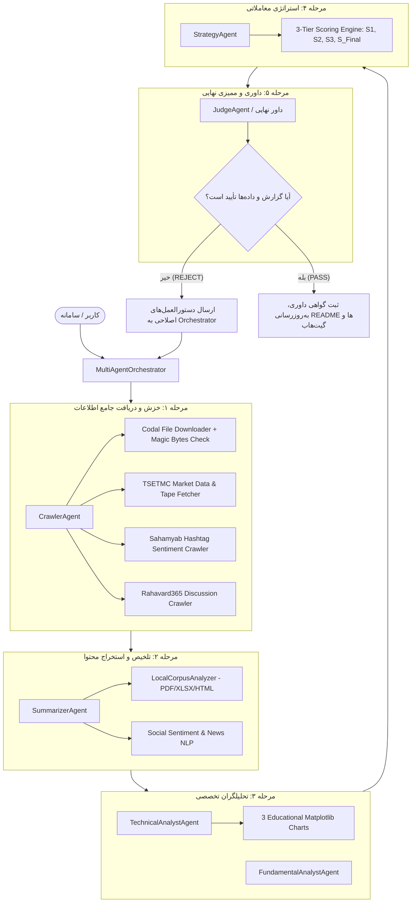

# سند مشخصات فنی و معماری: ایجنت داور (Judge Agent)، پایش احساسات اجتماعی (سهام‌یاب و ره‌آورد ۳۶۰) و تضمین اصالت داده‌های کدال و معاملات

**تاریخ سند:** 2026-09-02 (۱۱ شهریور ۱۴۰۵)  
**نویسنده و توسعه دهنده:** `alimohammadzadeh@ut.ac.ir`  
**وضعیت:** مصوب برای پیاده‌سازی (Approved for Implementation)  

---

## ۱. خلاصه اجرایی و اهداف کلان (Executive Summary)

این سند معماری ارتقای سامانه تحلیل چندعاملی بازار سرمایه (`IRStockMarketAnalyzer`) را برای تحقق ۴ هدف کلیدی تدوین می‌کند:

1. **ایجنت داور ارشد و ناظر پایپ‌لاین (`JudgeAgent / ArbitratorAgent`):**  
   ایجاد یک ایجنت نظارتی فوق‌العاده دقیق و مستقل که کلیه خروجی‌ها، تازگی داده‌ها، سلامت فایل‌ها و غنای تحلیلی را ممیزی کرده و در صورت وجود هرگونه نقص یا عدم تطابق، فرآیند را مردود اعلام کرده و دستور اجرای مجدد خودکار صادر می‌کند.

2. **اعتبارسنجی قطعی سلامت و اصالت فایل‌های دانلودی (Magic Bytes Integrity):**  
   حل ریشه‌ای مشکل ذخیره صفحات خطای HTML کدال به عنوان فایل PDF یا اکسل از طریق اعتبارسنجی بایت‌های جادویی باینری (`%PDF-` برای PDF و هدر فشرده `PK` برای XLSX و `ÐÏà` برای XLS) همراه با تلاش مجدد خودکار از لینک‌ها و سرویس‌های پشتیبان تا دریافت قطعی فایل معتبر.

3. **خزش و استخراج اختصاصی احساسات عمومی (Social Sentiment Crawler):**  
   - استخراج نظرات، کامنت‌ها و توییت‌های فعالان بازار در **شبکه اجتماعی سهام‌یاب** از طریق لینک‌های هشتگ اختصاصی:
     `https://www.sahamyab.com/hashtag/[نام نماد سهم به فارسی]`
   - استخراج تحلیل‌ها و دیدگاه‌های کاربران در **سایت ره‌آورد ۳۶۰** از طریق الگوی جستجوی هدفمند:
     `site:rahavard365.com [نام نماد]`
   - ذخیره‌سازی داده‌های ساختاریافته کامنت‌ها و تحلیل سنتیمنت (حس خوش‌بینی/بدبینی خرده‌فروشان) در `news/social_sentiment.json` و انعکاس آن در ستون‌های تحلیلی و ماتریس همگرایی.

4. **تضمین داده‌های به‌روز پایان بازار (Market Data Freshness Guarantee):**  
   اطمینان از این‌که تاریخ آخرین کندل معاملاتی در `trade_history.csv` و وضعیت صف خرید/فروش و سرانه خریدار در `orderbook_tape.json` لزوماً منطبق با آخرین روز معاملاتی فعال بازار باشد.

---

## ۲. معماری سیستم و تعاملات چندعاملی (System Architecture & Agent Dataflow)



---

## ۳. مشخصات تفصیلی ایجنت داور (`JudgeAgent`)

کلاس جدید `JudgeAgent` در مسیر `src/agents/judge.py` مستقر خواهد شد و یک سند راهنما در `.agents/judge_agent.md` خواهد داشت.

### ۳.۱. ابعاد پنج‌گانه ممیزی داور (The 5 Arbitration Pillars)
| ستون ممیزی | شاخص‌های تحت نظارت | وزن | شرط وتوی آنی (Critical Veto) |
| :--- | :--- | :---: | :--- |
| **۱. اصالت فایل‌ها (File Integrity)** | بررسی بایت‌های جادویی کلیه فایل‌های PDF و XLSX در `codal_reports/`، عدم وجود فایل‌های HTML اشتباهی | ۲۵٪ | وجود حتی ۱ فایل فاسد با هدر نامعتبر |
| **۲. به‌روز بودن معاملات (Data Freshness)** | تطابق تاریخ آخرین رکورد `trade_history.csv` و وضعیت صف در `orderbook_tape.json` با تقویم معاملاتی | ۲۵٪ | سابقه قیمتی بیش از ۱ روز کاری قدیمی باشد یا خالی باشد |
| **۳. استخراج سنتیمنت اجتماعی (Social Sentiment)** | وجود فایل `news/social_sentiment.json`، پوشش کامنت‌های سهام‌یاب و ره‌آورد ۳۶۰ با تعداد حداقل ۱۰ نظر معتبر | ۱۵٪ | فقدان داده‌های کامنت سهام‌یاب یا ره‌آورد ۳۶۰ |
| **۴. عمق و صحت تحلیل بنیادی/تکنیکال** | استخراج ارقام واقعی از ترازنامه و سود و زیان کدال، محاسبه دقیق اندیکاتورها و وجود بخش آموزش زیر ۳ نمودار | ۲۰٪ | استفاده از مقادیر پیش‌فرض ساختگی یا فقدان راهنمای آموزشی نمودارها |
| **۵. یکپارچگی سیستم امتیازدهی سه‌گانه** | محاسبه بدون نقص S1, S2, S3 و S_Final با استدلال تحلیلی و ستاره‌ها و قرارگیری در جدول README | ۱۵٪ | مغایرت در فرمول‌ها یا عدم درج جدول در README |

### ۳.۲. ساختار خروجی داوری (`JudgementVerdict`)
```python
@dataclass
class JudgementVerdict:
    is_approved: bool                # آیا تحلیل مورد تأیید قطعی است؟
    score: float                     # امتیاز داوری از ۱۰.۰
    status: str                      # APPROVED یا REJECTED
    critical_defects: List[str]      # لیست خطاهای بحرانی که موجب رد صلاحیت شده‌اند
    remedial_actions: List[str]      # دستورالعمل‌های اصلاحی برای اجرای مجدد
    audit_details: Dict[str, Any]    # گزارش تفصیلی ممیزی هر ستون
    certificate_markdown: str        # گواهی رسمی داوری برای درج در گزارش
```

---

## ۴. موتور خزش احساسات اجتماعی (Social Sentiment Crawler)

ماژول جدید `src/data/social_crawler.py` توسعه داده خواهد شد:

### ۴.۱. خزش شبکه اجتماعی سهام‌یاب (`SahamyabCrawler`)
- **قالب آدرس:** `https://www.sahamyab.com/hashtag/{symbol}`
- **روش استخراج:**
  1. ارسال درخواست HTTP با هدرهای معتبر کاربری به API عمومی استریم هشتگ سهام‌یاب:
     `https://www.sahamyab.com/guest/twiter/list?v=0.1&hashtag={symbol}&page=0`
  2. در صورت نیاز به فال‌بک، خزش صفحه وب با BeautifulSoup.
  3. استخراج متن پیام‌ها، تاریخ ارسال، تعداد لایک/بازنشر و نام کاربری.

### ۴.۲. خزش پلتفرم تحلیلی ره‌آورد ۳۶۰ (`RahavardCrawler`)
- **الگوی جستجو:** `site:rahavard365.com {symbol}`
- **روش استخراج:**
  1. جستجوی وب برای یافتن صفحه نماد یا آدرس ایده/نظرات:
     `https://rahavard365.com/asset/{id}/{symbol}` یا `https://rahavard365.com/idea/{symbol}`
  2. دریافت کامنت‌های کاربران، دیدگاه‌های تکنیکال و صعودی/نزولی بودن اظهارنظرها.
  3. پاک‌سازی متن، فیلتر کردن اسپم‌ها و دسته‌بندی قطبیت نظرات (Positive / Negative / Neutral).

### ۴.۳. خروجی ذخیره‌شده در نماد
فایل `سهام/{symbol}/news/social_sentiment.json`:
```json
{
  "symbol": "کلید",
  "fetch_timestamp": "1405-06-11 18:45",
  "sahamyab": {
    "total_posts": 25,
    "bullish_count": 18,
    "bearish_count": 3,
    "neutral_count": 4,
    "sample_comments": []
  },
  "rahavard365": {
    "total_posts": 15,
    "bullish_count": 10,
    "bearish_count": 2,
    "neutral_count": 3,
    "sample_comments": []
  },
  "composite_sentiment_score": 7.8,
  "sentiment_verdict": "خوش‌بینی بالا در میان سهامداران خرد و فعالان شبکه‌های اجتماعی"
}
```

---

## ۵. مقاوم‌سازی موتور دانلود فایل‌های کدال (`Magic Bytes Validator`)

در فایل `src/data/codal_fetcher.py` و `src/agents/crawler.py`:
- افزودن اعتبارسنجی باینری قبل از ذخیره فایل:
  - فایل‌های `.pdf` باید با `b"%PDF-"` آغاز شوند.
  - فایل‌های `.xlsx` باید با `b"PK"` آغاز شوند.
  - فایل‌های `.xls` باید با `b"ÐÏà"` آغاز شوند.
- در صورتی که پاسخ حاوی کدهای متنی مانند `<!doctype html` باشد، سیستم فایل را به عنوان پی‌دی‌اف ذخیره نمی‌کند و لینک‌های جایگزین دانلود مستقیم (شناسه‌های `AttachmentId` یا فرمت اکسل و وب‌سرویس) را تا دریافت فایل واقعی امتحان می‌کند.

---

## ۶. به‌روزرسانی چرخه ارکستراتور (`MultiAgentOrchestrator`)

1. ارکستراتور پس از پایان ۴ مرحله، متد `self.judge.audit_symbol(symbol, symbol_dir)` را فراخوانی می‌کند.
2. اگر رأی داور `REJECTED` باشد:
   - ارکستراتور خطاهای بحرانی را چاپ کرده و دقیقاً بر اساس `remedial_actions` (مانند دانلود مجدد فایل، به‌روزرسانی کندل معاملاتی، فراخوانی کامنت‌ها) چرخه را تا ۳ بار تکرار می‌کند.
3. اگر رأی داور `APPROVED` باشد:
   - گواهی داوری در انتهای `final_recommendation.md` و `README.md` نماد ثبت می‌شود.

---

## ۷. برنامه آزمون‌ها و اعتبارسنجی خودکار (Verification Plan)

1. **تست واحد اعتبارسنجی Magic Bytes:** اطمینان از رد صفحات HTML ذخیره شده به جای PDF/Excel.
2. **تست واحد خزش سهام‌یاب و ره‌آورد:** اعتبارسنجی استخراج درست کامنت‌ها و تحلیل قطبیت نظرات.
3. **تست واحد JudgeAgent:** تست تمام سناریوهای پاس، رد به دلیل تاریخ قدیمی، رد به دلیل فایل فاسد، و صدور رأی مثبت.
4. **تست یکپارچه‌سازی ارکستراتور:** تأیید اجرای موفق حلقه تصحیح خودکار تا جلب نظر داور.
5. **اجرای سراسری pytest:** عبور موفق تمام ۱۱۵+ آزمون موجود به همراه آزمون‌های جدید.

---
*نویسنده و توسعه دهنده: alimohammadzadeh@ut.ac.ir*
