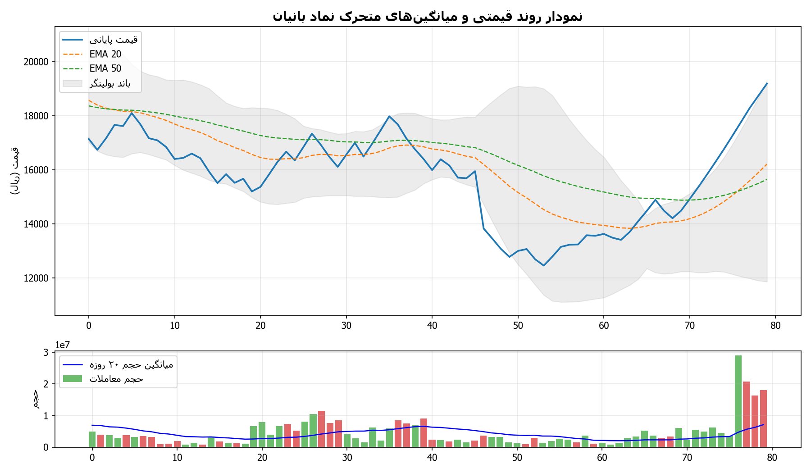
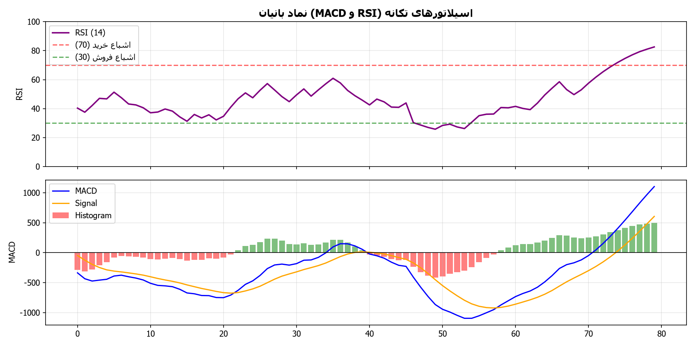
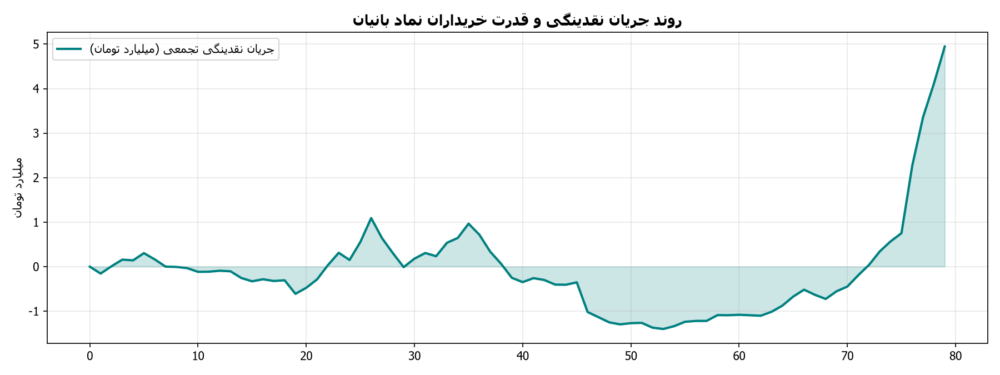

# گزارش تحلیلی جامع تکنیکال و تابلوخوانی نماد بانیان
**تاریخ تحلیل:** 1405/06/07 - 11:56  
**آخرین قیمت معاملاتی:** 19,190 ریال | **دامنه روز:** 18,800 تا 19,300 ریال  
**حجم معاملات آخرین روز:** 18,053,091 برگه سهم (میانگین ۲۰ روزه: 7,122,297)

---

## ۱. تحلیل ساختار روند و امواج (Trend Structure & Wave Patterns)
- **وضعیت کلی روند:** 🟢 صعودی - صعودی تثبیت‌شده (قیمت بالاتر از میانگین‌های کوتاه و میان‌مدت قرار دارد)
- **سقف ماژور دوره (Swing High):** 22,150 ریال
- **کف ماژور دوره (Swing Low):** 0 ریال
- **دامنه نوسان واقعی (ATR 14):** 489 ریال

### جدول میانگین‌های متحرک نمایی (Exponential Moving Averages)
| شاخص میانگین | مقدار عددی (ریال) | فاصله با قیمت فعلی | موقعیت تکنیکال |
| :--- | :--- | :--- | :--- |
| **EMA 20** | 16,213 | +18.4% | حمایت پویا |
| **EMA 50** | 15,644 | +22.7% | حمایت میان‌مدت |
| **EMA 100** | 15,987 | +20.0% | حمایت / مقاومت تراز میانی |
| **EMA 200** | 16,352 | +17.4% | مرز روند بلندمدت و استراتژیک |

### وضعیت باندهای بولینگر (Bollinger Bands)
- **باند بالایی (Upper Band):** 19,267 ریال
- **باند میانی (SMA 20):** 15,566 ریال
- **باند پایینی (Lower Band):** 11,865 ریال
- **عرض باند (Bandwidth):** 47.6% (سنجش میزان فشردگی نوسانات)

---

## ۲. تحلیل سیستم معاملاتی ایچیموکو (Ichimoku Kinko Hyo)
- **خط تنکان‌سن (Tenkan-sen 9):** 17,330 ریال
- **خط کیجون‌سن (Kijun-sen 26):** 15,940 ریال
- **ابر کومو اسپن A (Senkou Span A):** 14,820 ریال
- **ابر کومو اسپن B (Senkou Span B):** 15,410 ریال
- **ارزیابی تقاطع خطوط:** تنکان‌سن بالای کیجون‌سن (سیگنال تقاطع صعودی TK Cross)
- **موقعیت قیمت نسبت به ابر کومو:** قیمت بالای ابر کومو قرار دارد (موقعیت روند صعودی پرقدرت و حمایت ابر کومو)

---

## ۳. اسیلاتورهای تکانه و واگرایی‌ها (Momentum Oscillators & Divergences)
- **شاخص قدرت نسبی (RSI 14):** **82.6** (اشباع خرید (احتمال شناسایی سود یا استراحت موقت روند))
- **مکدی (MACD 12,26,9):** 1103.03 | **خط سیگنال:** 605.59 | **هیستوگرام:** 497.45

### بررسی وضعیت واگرایی‌های تکنیکال (Divergence Analysis)
- **واگرایی در اسیلاتور RSI:** واگرایی واضحی در اسیلاتور RSI مشاهده نشده و تکانه همگام با نوسانات قیمت است.
- **واگرایی در اندیکاتور MACD:** هیستوگرام و خط مکدی در تعادل با رفتار روند قیمتی نوسان می‌کنند.

---

## ۴. ترازهای فیبوناچی (Fibonacci Retracement & Expansion Levels)
مبنای محاسبه ترازهای فیبوناچی اصلاحی بر اساس آخرین موج حرکتی بین کف 0 و سقف 22,150 ریال:

| نسبت فیبوناچی | سطح قیمتی (ریال) | فاصله با قیمت فعلی | نقش تکنیکال |
| :--- | :--- | :--- | :--- |
| **0.0** | 22,150 | -13.4% | سقف موج (Pivot High) |
| **0.236** | 16,923 | +13.4% | حمایت / مقاومت اول اصلاحی (23.6%) |
| **0.382** | 13,689 | +40.2% | تراز اصلاحی نرمال (38.2%) |
| **0.5** | 11,075 | +73.3% | تراز میانی تعادلی (50.0%) |
| **0.618** | 8,461 | +126.8% | تراز طلایی و پرتقاضا (61.8%) |
| **0.786** | 4,740 | +304.8% | آخرین سد دفاعی روند (78.6%) |
| **1.0** | 0 | +1919000000000.0% | کف موج (Pivot Low) |

- **نزدیک‌ترین سطح حمایت معتبر:** **16,923 ریال**
- **نزدیک‌ترین سطح مقاومت معتبر:** **22,150 ریال**

---

## ۵. تابلوخوانی و رفتارشناسی حقیقی/حقوقی (Tape Reading & Smart Money Flow)
- **نسبت قدرت خریدار به فروشنده:** **7.15** (قدرت خریدار بسیار عالی (ورود پول هوشمند و خرید قدرتمند توسط کدهای درشت حقیقی))
- **سرانه خرید حقیقی:** 40,483 سهم | **سرانه فروش حقیقی:** 5,660 سهم
- **حجم خرید حقیقی:** 11,213,786 سهم | **حجم خرید حقوقی:** 6,839,305 سهم
- **حجم فروش حقیقی:** 16,793,035 سهم | **حجم فروش حقوقی:** 1,260,056 سهم
- **وضعیت حجم معاملات:** ثبت حجم مشکوک و بیش از ۲ برابر میانگین ۲۰ روزه (نشانه‌ای از تحرکات مهم بازیگران)

---

## ۶. نمودارهای تحلیل تکنیکال و بصری
- 
- 
- 

---
*نویسنده و توسعه دهنده: alimohammadzadeh@ut.ac.ir*