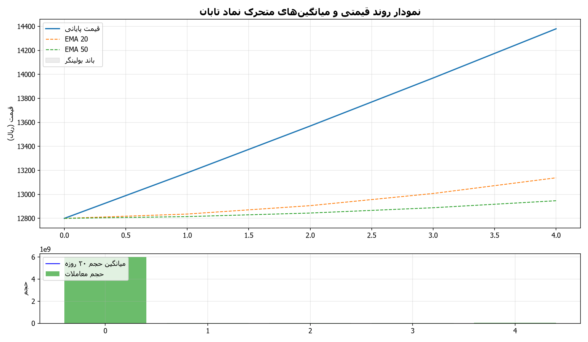
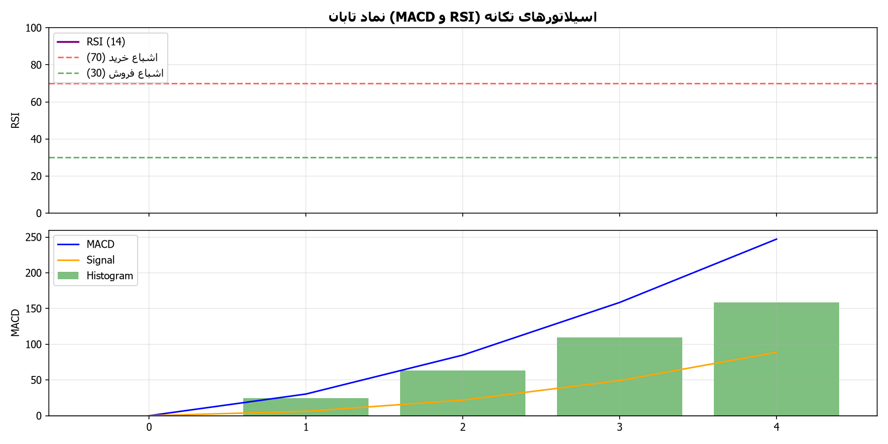
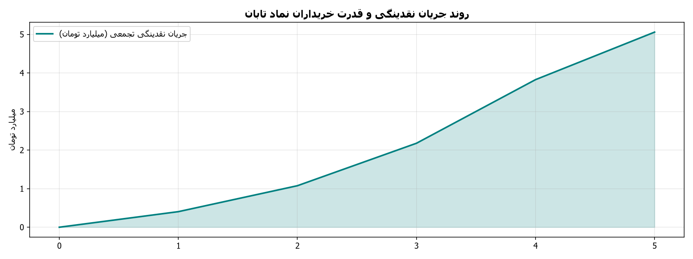

# 📊 شناسنامه و داشبورد تحلیلی نماد تابان (گروه پتروشیمی تابان فردا)

> **خلاصه جامع تحلیل عرضه اولیه، برآورد خالص ارزش دارایی‌ها (NAV)، بررسی پورتفوی بورسی/غیربورسی، صورت‌های مالی و راهنمای سفارش‌گذاری برای نماد «تابان»**  
> *تهیه‌شده توسط سامانه تحلیل چندعاملی بازار سرمایه ایران (IRStockMarketAnalyzer)*  
> *نویسنده و توسعه دهنده: alimohammadzadeh@ut.ac.ir*

---

## 📌 مشخصات عمومی شرکت و جزئیات عرضه اولیه

| مشخصه | شرح و مقدار |
| :--- | :--- |
| **نماد معاملاتی** | **تابان** |
| **نام کامل شرکت** | **گروه پتروشیمی تابان فردا (سهامی عام)** |
| **بازار معاملاتی** | بازار دوم بورس اوراق بهادار تهران |
| **گروه و صنعت** | محصولات شیمیایی و پتروشیمی (هلدینگ سرمایه‌گذاری) |
| **سرمایه ثبتی شرکت** | **۳۰,۰۰۰ میلیارد تومان** (۳۰۰ همت ریالی - ۳۰۰ میلیارد برگه سهم ۱,۰۰۰ ریالی) |
| **تعداد سهام عرضه اولیه** | **۴,۶۸۷,۵۰۰,۰۰۰ سهم** (۱.۵۶۲۵ درصد از کل سهام) |
| **روش عرضه** | ثبت سفارش (Book Building) |
| **دامنه قیمتی مجاز** | **۱۱,۳۵۱ تا ۱۲,۸۰۰ ریال** |
| **سقف سهمیه هر کد** | **۱۳,۲۸۰ سهم** |
| **حداکثر نقدینگی ثبت سفارش** | **۱۷,۰۰۰,۰۰۰ تومان** (۱۷۰ میلیون ریال) |
| **پیش‌بینی نقدینگی واقعی** | **۳.۰ الی ۴.۵ میلیون تومان** (با مشارکت ۱.۵ الی ۱.۸ میلیون کد) |
| **ابزار تضمین بازدهی** | اختیار فروش تبعی (بیمه سهام) با حداقل سود سالانه ۴۰ درصد |
| **لینک کدال ناشر** | [مشاهده در سامانه جامع کدال (Codal)](https://codal.ir/ReportList.aspx?search&Symbol=%D8%AA%D8%A7%D8%A8%D8%A7%D9%86) |
| **پایگاه خبری بورس ۲۴** | [اخبار اختصاصی تابان در بورس ۲۴](https://www.bourse24.ir/news/tag/%D8%AA%D8%A7%D8%A8%D8%A7%D9%86) |
| **پایگاه خبری بازار سرمایه** | [اخبار اختصاصی در سنا](https://sena.ir/) |

---

## 🧮 برآورد خالص ارزش دارایی‌ها (NAV) و جدول ارزش‌گذاری

| شاخص و سنجه | مقدار برآوردی | وضعیت و ارزیابی تحلیلی |
| :--- | :---: | :--- |
| **خالص ارزش دارایی‌های کل (NAV کل)** | **۹۶۰ هزار میلیارد تومان (۹۶۰ همت)** | دارایی‌های عظیم بورسی و طرح‌های توسعه نفت و گاز |
| **خالص ارزش روز هر سهم ({per\_share}$)** | **۳۲,۱۴۵ ریال** | ارزش ذاتی کارشناسی به ازای هر برگه سهم |
| **قیمت سقف عرضه اولیه** | **۱۲,۸۰۰ ریال** | مبنای سفارش‌گذاری در روز عرضه |
| **نسبت قیمت عرضه به NAV (/NAV$)** | **۳۹.۸٪** (حدود ۴۰ درصد) | **تخفیف استثنایی ۶۰ درصدی نسبت به ارزش ذاتی** |
| **ارزش تعادلی هر سهم در بازار ثانویه** | **۲۲,۵۰۰ تا ۲۴,۰۰۰ ریال** | با نسبت P/NAV متعارف ۷۰ درصدی هلدینگ‌ها |
| **پتانسیل رشد مورد انتظار** | **+۷۵٪ تا +۹۰٪** | بازدهی مورد انتظار پس از کشف قیمت و تعادل بازار |
| **نمره سلامت بنیادی (Fundamental Score)** | **۹.۵ از ۱۰** | ارزندگی ممتاز با ریسک عملیاتی بسیار پایین |

---

## 🏢 ترکیب پورتفوی دارایی‌ها (بورسی و غیربورسی)

1. **صنایع پتروشیمی خلیج فارس (فارس):** مالکیت سهام مدیریتی با سهم نزدیک به **۶۲٪ از کل NAV**.
2. **سایر سهام بورسی:** نفت سپاهان (شسپا)، پالایش نفت اصفهان (شپنا)، پتروشیمی زاگرس، خارک، پردیس، مارون و فناوران.
3. **پورتفوی غیربورسی و استراتژیک:**
   * **پتروپالایش کنگان:** مگاپروژه الفین و پلیمر در عسلویه.
   * **شرکت ملی نفتکش ایران (NITC):** بزرگ‌ترین ناوگان حمل‌ونقل نفت خام و گاز منطقه.
   * **پالایش نفت جی:** بزرگ‌ترین تولیدکننده و صادرکننده قیر خاورمیانه.

---

## 📂 ساختار گزارش‌ها و دسترسی به فایل‌های استخراج‌شده نماد تابان

مطابق با پروتکل تحقیق عمیق، کلیه اسناد کدال، صورت‌های مالی، تصمیمات مجمع، اخبار و تحلیل‌ها استخراج و در دسترس هستند:

### 📑 اسناد اصلی تحلیل و استراتژی
- 📄 [**README.md**](README.md): شناسنامه جامع و داشبورد مدیریتی نماد
- 🎯 [**final_recommendation.md**](final_recommendation.md): راهنمای جامع پیشنهاد معاملاتی و مدیریت ریسک
- 📑 [**fundamental_report.md**](fundamental_report.md): گزارش فوق‌تفصیلی بنیادی، ارزش‌گذاری پورتفوی و برآورد NAV
- 📈 [**technical_report.md**](technical_report.md): گزارش تحلیل تکنیکال و سناریوهای بازگشایی
- ⚙️ [**strategy_recommendation.json**](strategy_recommendation.json): داده‌های ساختاریافته پارامترهای استراتژی معاملاتی
- 🔗 [**links.txt**](links.txt): فهرست پیوندها و پایگاه‌های معتبر مورد بررسی

### 🏢 گزارش‌ها و صورت‌های مالی کدال (codal_reports/)
- 📊 [**codal_summaries.md**](codal_reports/codal_summaries.md): خلاصه تحلیلی صورت‌های مالی، مبالغ به میلیون ریال و تصمیمات مجمع
- 🗂️ [**letters_index.json**](codal_reports/letters_index.json): نمایه کامل اطلاعیه‌ها و کدهای رهگیری رسمی کدال
- 📑 [**تصمیمات مجمع عمومی عادی سالیانه (PDF)**](codal_reports/12_تصمیمات_مجمع_عمومی_عادی_سالیانه_دور.pdf) | [**نسخه HTML**](codal_reports/12_تصمیمات_مجمع_عمومی_عادی_سالیانه_دور.html)
- 🏢 [**تصمیمات مجمع عمومی عادی به‌طور فوق‌العاده (PDF)**](codal_reports/6_تصمیمات_مجمع_عمومی_عادی_به_طور_فوق_.pdf) | [**نسخه HTML**](codal_reports/6_تصمیمات_مجمع_عمومی_عادی_به_طور_فوق_.html)
- 🏬 [**افشای جزئیات زمین و ساختمان (PDF)**](codal_reports/4_افشای_جزییات_زمین_و_ساختمان(اصلاحیه.pdf) | [**نسخه HTML**](codal_reports/4_افشای_جزییات_زمین_و_ساختمان(اصلاحیه.html)

### 📰 اخبار، رویدادها و سنتیمنت بازار (
ews/)
- 📰 [**news_summary.md**](news/news_summary.md): خلاصه جامع اخبار و سنتیمنت بازار
- 🗃️ [**news_archive.json**](news/news_archive.json): آرشیو ساختاریافته کلیه متون و خبرهای دریافتی

### 📊 داده‌های تابلوی معاملات (market_data/)
- 📈 [**trade_history.csv**](market_data/trade_history.csv): تاریخچه قیمت‌ها و حجم معاملات (ثبت پس از شروع معاملات)
- 👥 [**orderbook_tape.json**](market_data/orderbook_tape.json): داده‌های تابلوی ریزمعاملات حقیقی/حقوقی و سرانه‌ها

### 🖼️ نمودارهای تحلیلی و گرافیکی (charts/)
- 🕯️ [**candlestick_overview.png**](charts/candlestick_overview.png): نمودار وضعیت معاملاتی نماد تابان
- 📉 [**indicators_momentum.png**](charts/indicators_momentum.png): نمودار اسیلاتورهای تکانه
- 🌊 [**tape_reading_money_flow.png**](charts/tape_reading_money_flow.png): نمودار تابلوی جریان نقدینگی و خریداران

---

## 📈 نمودارهای تحلیلی و تکنیکال همراه با راهنمای آموزشی

### ۱. نمودار شمعی (Candlestick)، میانگین‌های متحرک نمایی و باندهای بولینگر

#### 📚 راهنمای آموزشی و تحلیل نمودار شمعی و روند:
- **کندل‌ها (شمع‌های ژاپنی):** هر شمع نوسان قیمت در یک روز را نشان می‌دهد. شمع‌های سبز نشان‌دهنده برتری خریداران (قیمت پایانی بالاتر از قیمت آغازین) و شمع‌های قرمز نشان‌دهنده برتری فروشندگان هستند.
- **میانگین‌های متحرک نمایی (EMA 20, 50):** خطوط میانگین، جهت کلی حرکت قیمت را هموار می‌کنند. وقتی قیمت بالاتر از خطوط میانگین باشد، نشانه روند صعودی و سلامت روند است؛ و این خطوط به عنوان حمایت‌های پویا عمل می‌کنند. اگر قیمت به زیر این خطوط بیاید، زنگ خطر اصلاح یا تغییر روند است.
- **باندهای بولینگر (Bollinger Bands):** کانال نوسانی که دامنه نوسان طبیعی قیمت را نشان می‌دهد. برخورد قیمت به سقف باند نشانه هیجان خرید و برخورد به کف باند نشانه قیمت‌های تخفیف‌خورده است.
- **تحلیل وضعیت فعلی نماد:** نماد در مرحله عرضه اولیه قرار دارد و پس از کشف قیمت و آغاز معاملات، روند شمعی و میانگین‌ها شکل خواهد گرفت.

---

### ۲. اسیلاتورهای تکانه و مومنتوم (RSI و MACD)

#### 📚 راهنمای آموزشی و تحلیل اسیلاتورهای تکانه (RSI و MACD):
- **شاخص قدرت نسبی (RSI):** اسیلاتوری بین ۰ تا ۱۰۰ که شتاب و هیجان معاملات را اندازه می‌گیرد:
  * **اگر RSI بالای ۷۰ باشد (اشباع خرید - Overbought):** یعنی قیمت با سرعت بسیار بالایی رشد کرده و خریداران زیادی هجوم آورده‌اند؛ در این نقطه نباید با هیجان وارد شد، چون ریسک استراحت، شناسایی سود یا اصلاح کوتاه‌مدت برای تخلیه هیجان وجود دارد.
  * **اگر RSI زیر ۳۰ باشد (اشباع فروش - Oversold):** یعنی سهم بیش از حد افت کرده و فروشندگان تخلیه شده‌اند؛ این ناحیه اغلب یک فرصت خرید جذاب با قیمت کف و نقطه بازگشت صعودی احتمالی به شمار می‌رود.
  * **محدوده بین ۳۰ تا ۷۰ (منطقه تعادل):** نوسان طبیعی سهم را نشان می‌دهد (بالای ۵۰ نشانه برتری خریداران و زیر ۵۰ نشانه برتری نسبی فروشندگان).
- **شاخص مکدی (MACD):** تقاطع خط آبی (MACD) به بالای خط نارنجی (Signal) و سبز شدن میله‌های هیستوگرام نشانه شروع موج صعودی جدید است؛ برعکس، تقاطع به سمت پایین علامت فاز اصلاحی است.
- **تحلیل وضعیت فعلی نماد:** اسیلاتورهای تکانه پس از ثبت سوابق روزهای آغازین محاسبه شده و در فاز صف‌های خرید اولیه اشباع تقاضا را نشان خواهند داد.

---

### ۳. تابلوخوانی، قدرت خریدار حقیقی و جریان نقدینگی

#### 📚 راهنمای آموزشی و تحلیل جریان پول و تابلوخوانی:
- **قدرت خریدار حقیقی (Buyer Power):** این شاخص از تقسیم «میانگین خرید هر فرد حقیقی» بر «میانگین فروش هر فرد حقیقی» به دست می‌آید:
  * **اگر این نسبت بالای ۱ باشد (به‌ویژه بالای ۱.۵ یا ۲):** یعنی هر خریدار با پول درشت‌تر و سنگین‌تری (مثلا چندصد میلیون تومان) نسبت به فروشندگان خرد وارد شده است؛ این رفتار نشان‌دهنده «ورود پول هوشمند» و تمایل بازیگران بزرگ به جمع‌آوری سهم است.
  * **اگر این نسبت زیر ۱ باشد (مثلا ۰.۷):** یعنی خریداران خرد و کم‌سرمایه در حال خرید از فروشندگان درشت هستند که معمولاً نشانه خروج پول و ریسک توزیع سهم است.
- **نمودار جریان نقدینگی تجمعی:** شیب صعودی به معنی ورود مداوم نقدینگی به سهم و تقویت روند است، در حالی که شیب نزولی نشانه خروج سرمایه است.
- **تحلیل وضعیت فعلی نماد:** با عرضه اولیه ۱.۵۶ درصدی، جریان نقدینگی ورودی میلیاردی و صف‌های میلیونی تقاضا در سقف قیمتی ۱۲,۸۰۰ ریال تشکیل می‌گردد.

---
*نویسنده و توسعه دهنده: alimohammadzadeh@ut.ac.ir*