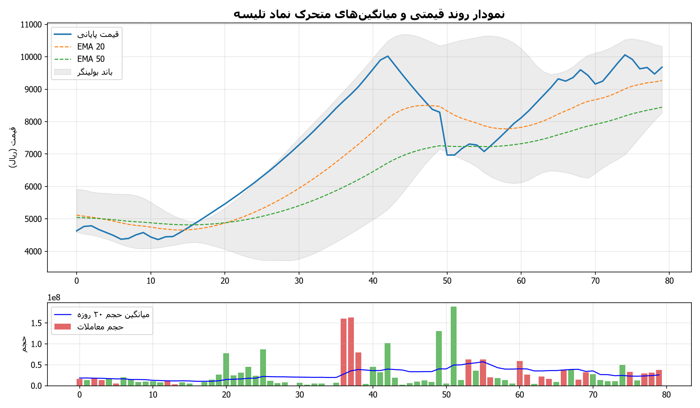
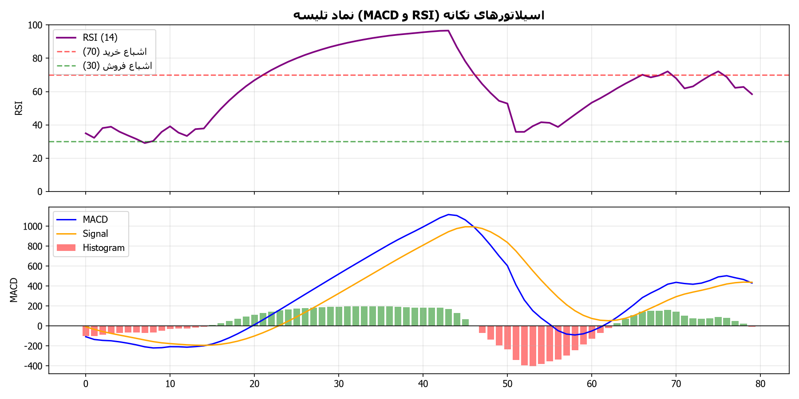
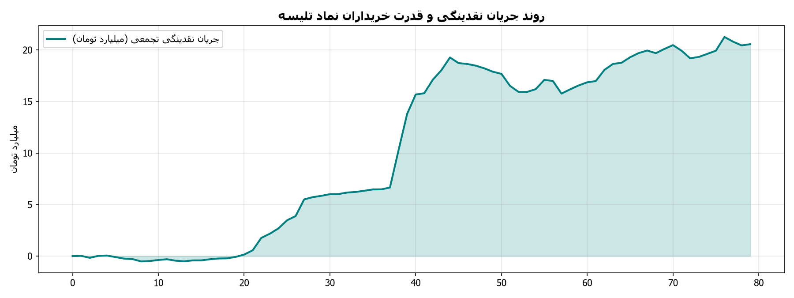

# گزارش تحلیلی جامع تکنیکال و تابلوخوانی نماد تلیسه
**تاریخ تحلیل:** 1405/06/11 - 19:47  
**آخرین قیمت معاملاتی:** 9,630 ریال | **دامنه روز:** 9,630 تا 9,630 ریال  
**حجم معاملات آخرین روز:** 12,932,051 برگه سهم (میانگین ۲۰ روزه: 22,738,102)

---

## ۱. تحلیل ساختار روند و امواج (Trend Structure & Wave Patterns)
- **وضعیت کلی روند:** 🟢 صعودی - صعودی تثبیت‌شده (قیمت بالاتر از میانگین‌های کوتاه و میان‌مدت قرار دارد)
- **سقف ماژور دوره (Swing High):** 10,360 ریال
- **کف ماژور دوره (Swing Low):** 4,242 ریال
- **دامنه نوسان واقعی (ATR 14):** 372 ریال

### جدول میانگین‌های متحرک نمایی (Exponential Moving Averages)
| شاخص میانگین | مقدار عددی (ریال) | فاصله با قیمت فعلی | موقعیت تکنیکال |
| :--- | :--- | :--- | :--- |
| **EMA 20** | 9,148 | +5.3% | حمایت پویا |
| **EMA 50** | 8,297 | +16.1% | حمایت میان‌مدت |
| **EMA 100** | 7,258 | +32.7% | حمایت / مقاومت تراز میانی |
| **EMA 200** | 6,109 | +57.6% | مرز روند بلندمدت و استراتژیک |

### وضعیت باندهای بولینگر (Bollinger Bands)
- **باند بالایی (Upper Band):** 10,518 ریال
- **باند میانی (SMA 20):** 9,016 ریال
- **باند پایینی (Lower Band):** 7,514 ریال
- **عرض باند (Bandwidth):** 33.3% (سنجش میزان فشردگی نوسانات)

---

## ۲. تحلیل سیستم معاملاتی ایچیموکو (Ichimoku Kinko Hyo)
- **خط تنکان‌سن (Tenkan-sen 9):** 9,630 ریال
- **خط کیجون‌سن (Kijun-sen 26):** 8,565 ریال
- **ابر کومو اسپن A (Senkou Span A):** 8,412 ریال
- **ابر کومو اسپن B (Senkou Span B):** 7,216 ریال
- **ارزیابی تقاطع خطوط:** تنکان‌سن بالای کیجون‌سن (سیگنال تقاطع صعودی TK Cross)
- **موقعیت قیمت نسبت به ابر کومو:** قیمت بالای ابر کومو قرار دارد (موقعیت روند صعودی پرقدرت و حمایت ابر کومو)

---

## ۳. اسیلاتورهای تکانه و واگرایی‌ها (Momentum Oscillators & Divergences)
- **شاخص قدرت نسبی (RSI 14):** **62.3** (تکانه مثبت و برتری نسبی خریداران)
- **مکدی (MACD 12,26,9):** 484.25 | **خط سیگنال:** 434.03 | **هیستوگرام:** 50.22

### بررسی وضعیت واگرایی‌های تکنیکال (Divergence Analysis)
- **واگرایی در اسیلاتور RSI:** واگرایی واضحی در اسیلاتور RSI مشاهده نشده و تکانه همگام با نوسانات قیمت است.
- **واگرایی در اندیکاتور MACD:** تشکیل واگرایی منفی مکدی (کاهش انرژی تقاضا در قله‌های قیمتی).

---

## ۴. ترازهای فیبوناچی (Fibonacci Retracement & Expansion Levels)
مبنای محاسبه ترازهای فیبوناچی اصلاحی بر اساس آخرین موج حرکتی بین کف 4,242 و سقف 10,360 ریال:

| نسبت فیبوناچی | سطح قیمتی (ریال) | فاصله با قیمت فعلی | نقش تکنیکال |
| :--- | :--- | :--- | :--- |
| **0.0** | 10,360 | -7.0% | سقف موج (Pivot High) |
| **0.236** | 8,916 | +8.0% | حمایت / مقاومت اول اصلاحی (23.6%) |
| **0.382** | 8,023 | +20.0% | تراز اصلاحی نرمال (38.2%) |
| **0.5** | 7,301 | +31.9% | تراز میانی تعادلی (50.0%) |
| **0.618** | 6,579 | +46.4% | تراز طلایی و پرتقاضا (61.8%) |
| **0.786** | 5,551 | +73.5% | آخرین سد دفاعی روند (78.6%) |
| **1.0** | 4,242 | +127.0% | کف موج (Pivot Low) |

- **نزدیک‌ترین سطح حمایت معتبر:** **8,916 ریال**
- **نزدیک‌ترین سطح مقاومت معتبر:** **10,360 ریال**

---

## ۵. تابلوخوانی و رفتارشناسی حقیقی/حقوقی (Tape Reading & Smart Money Flow)
- **نسبت قدرت خریدار به فروشنده:** **0.18** (برتری فروشندگان و فشار عرضه از سوی کدهای حقیقی)
- **سرانه خرید حقیقی:** 17,173 سهم | **سرانه فروش حقیقی:** 98,122 سهم
- **حجم خرید حقیقی:** 4,619,405 سهم | **حجم خرید حقوقی:** 8,312,646 سهم
- **حجم فروش حقیقی:** 9,714,077 سهم | **حجم فروش حقوقی:** 3,217,974 سهم
- **وضعیت حجم معاملات:** حجم معاملات در محدوده نرمال و نزدیک به میانگین دوره‌ای

---

## ۶. نمودارهای تحلیل تکنیکال و بصری همراه با راهنمای تحلیلی و آموزشی

### ۱. نمودار شمعی (Candlestick)، میانگین‌های متحرک نمایی و باندهای بولینگر

#### 📚 راهنمای آموزشی و تحلیل نمودار شمعی و روند:
- **کندل‌ها (شمع‌های ژاپنی):** هر کندل نوسانات قیمت در یک روز معاملاتی را نشان می‌دهد. بدنه سبز به معنی پیروزی خریداران (قیمت پایانی بالاتر از قیمت شروع) و بدنه قرمز به معنی غلبه فروشندگان است. سایه‌های بالا و پایین نیز سقف و کف قیمت روز را نشان می‌دهند.
- **میانگین‌های متحرک نمایی (EMA 20 و EMA 50):** این خطوط میانگین قیمت در ۲۰ و ۵۰ روز اخیر را به صورت هموار ترسیم می‌کنند:
  * **اگر قیمت بالای میانگین‌ها باشد:** روند سهم صعودی و پرقدرت است و خطوط میانگین مانند تکیه‌گاه و «حمایت پویا» عمل می‌کنند تا مانع از افت بیشتر قیمت شوند.
  * **اگر قیمت زیر میانگین‌ها بیاید:** نشانه ضعف روند، فشار عرضه و هشدار اصلاح قیمتی است.
- **باندهای بولینگر (Bollinger Bands):** کانالی متشکل از سقف، خط میانی و کف که دامنه طبیعی نوسان سهم را نشان می‌دهد. برخورد قیمت به سقف باند نشانه داغ شدن معاملات و هیجان خرید، و برخورد به کف باند نشانه قیمت‌های ارزان و فرصت خرید بالقوه است.
- **تحلیل وضعیت فعلی نماد:** آخرین قیمت در سطح **9,630 ریال** در مقایسه با میانگین ۲۰ روزه (9,148 ریال) و میانگین ۵۰ روزه (8,297 ریال) موقعیت **صعودی تثبیت‌شده (قیمت بالاتر از میانگین‌های کوتاه و میان‌مدت قرار دارد)** را ثبت کرده است.

---

### ۲. اسیلاتورهای تکانه و مومنتوم (RSI و MACD)

#### 📚 راهنمای آموزشی و تحلیل اسیلاتورهای تکانه (RSI و MACD):
- **شاخص قدرت نسبی (RSI):** اسیلاتوری بین ۰ تا ۱۰۰ که شتاب و هیجان معاملات را اندازه می‌گیرد:
  * **اگر RSI بالای ۷۰ باشد (اشباع خرید - Overbought):** یعنی قیمت با سرعت بسیار بالایی رشد کرده و خریداران زیادی هجوم آورده‌اند؛ در این نقطه نباید با هیجان وارد شد، چون ریسک استراحت، شناسایی سود یا اصلاح کوتاه‌مدت برای تخلیه هیجان وجود دارد.
  * **اگر RSI زیر ۳۰ باشد (اشباع فروش - Oversold):** یعنی سهم بیش از حد افت کرده و فروشندگان تخلیه شده‌اند؛ این ناحیه اغلب یک فرصت خرید جذاب با قیمت کف و نقطه بازگشت صعودی احتمالی به شمار می‌رود.
  * **محدوده بین ۳۰ تا ۷۰ (منطقه تعادل):** نوسان طبیعی سهم را نشان می‌دهد (بالای ۵۰ نشانه برتری خریداران و زیر ۵۰ نشانه برتری نسبی فروشندگان).
- **شاخص همگرایی/واگرایی میانگین متحرک (MACD):**
  * تقاطع خط آبی (MACD) به بالای خط نارنجی (Signal) و سبز شدن میله‌های هیستوگرام نشانه شروع یک موج صعودی پرشتاب است.
  * برعکس، تقاطع به سمت پایین و قرمز شدن میله‌ها علامت کاهش قدرت خریداران و شروع فاز اصلاحی است.
- **تحلیل وضعیت فعلی نماد:** مقدار فعلی RSI برابر با **62.3** (تکانه مثبت و برتری نسبی خریداران) است و هیستوگرام مکدی در وضعیت **+50.22** نوسان می‌کند.

---

### ۳. تابلوخوانی، قدرت خریدار حقیقی و جریان نقدینگی

#### 📚 راهنمای آموزشی و تحلیل جریان پول و تابلوخوانی:
- **قدرت خریدار حقیقی (Buyer Power):** این شاخص از تقسیم «میانگین خرید هر فرد حقیقی» بر «میانگین فروش هر فرد حقیقی» به دست می‌آید:
  * **اگر این نسبت بالای ۱ باشد (به‌ویژه بالای ۱.۵ یا ۲):** یعنی هر خریدار با پول درشت‌تر و سنگین‌تری (مثلا چندصد میلیون تومان) نسبت به فروشندگان خرد وارد شده است؛ این رفتار نشان‌دهنده «ورود پول هوشمند» و تمایل بازیگران بزرگ به جمع‌آوری سهم است.
  * **اگر این نسبت زیر ۱ باشد (مثلا ۰.۷):** یعنی خریداران خرد و کم‌سرمایه در حال خرید از فروشندگان درشت هستند که معمولاً نشانه خروج پول و ریسک توزیع سهم است.
- **نمودار جریان نقدینگی تجمعی (Cumulative Money Flow):** این منحنی ردپای سرمایه‌های ورودی و خروجی به سهم را نشان می‌دهد. شیب صعودی خط به معنی ورود مداوم نقدینگی و تقویت روند صعودی است، در حالی که شیب نزولی علامت خروج پول از بازار سهم است.
- **تحلیل وضعیت فعلی نماد:** نسبت قدرت خریدار به فروشنده سهم برابر با **0.18** (برتری فروشندگان و فشار عرضه از سوی کدهای حقیقی) با سرانه خرید **17,173 سهم** ثبت گردیده است.

---
*نویسنده و توسعه دهنده: alimohammadzadeh@ut.ac.ir*