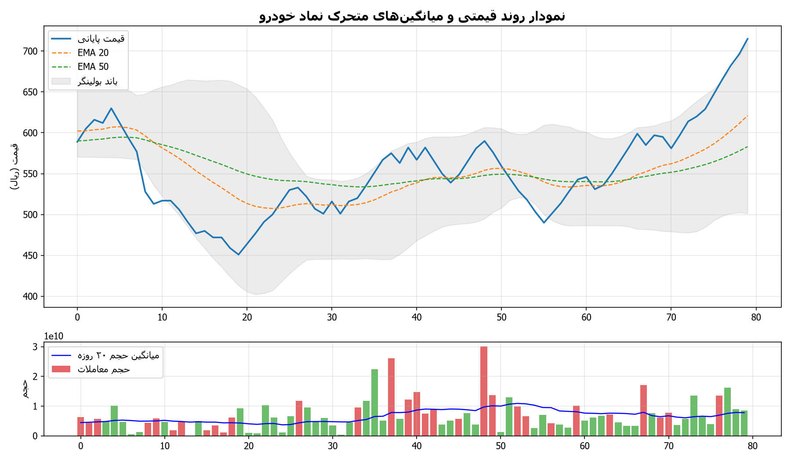
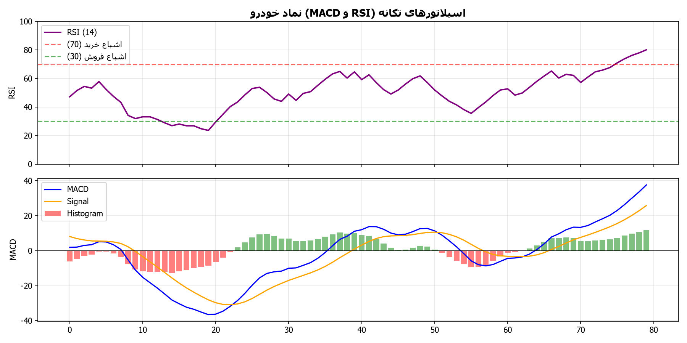
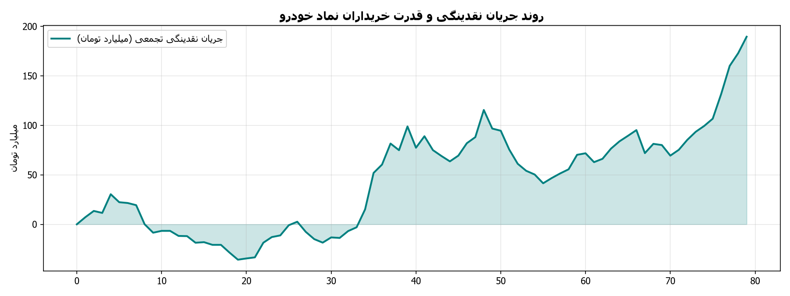

# گزارش تحلیلی جامع تکنیکال و تابلوخوانی نماد خودرو
**تاریخ تحلیل:** 1405/06/07 - 11:47  
**آخرین قیمت معاملاتی:** 715 ریال | **دامنه روز:** 705 تا 716 ریال  
**حجم معاملات آخرین روز:** 8,545,744,594 برگه سهم (میانگین ۲۰ روزه: 7,773,205,033)

---

## ۱. تحلیل ساختار روند و امواج (Trend Structure & Wave Patterns)
- **وضعیت کلی روند:** 🟢 صعودی - صعودی تثبیت‌شده (قیمت بالاتر از میانگین‌های کوتاه و میان‌مدت قرار دارد)
- **سقف ماژور دوره (Swing High):** 716 ریال
- **کف ماژور دوره (Swing Low):** 446 ریال
- **دامنه نوسان واقعی (ATR 14):** 23 ریال

### جدول میانگین‌های متحرک نمایی (Exponential Moving Averages)
| شاخص میانگین | مقدار عددی (ریال) | فاصله با قیمت فعلی | موقعیت تکنیکال |
| :--- | :--- | :--- | :--- |
| **EMA 20** | 621 | +15.1% | حمایت پویا |
| **EMA 50** | 583 | +22.6% | حمایت میان‌مدت |
| **EMA 100** | 597 | +19.7% | حمایت / مقاومت تراز میانی |
| **EMA 200** | 832 | -14.0% | مرز روند بلندمدت و استراتژیک |

### وضعیت باندهای بولینگر (Bollinger Bands)
- **باند بالایی (Upper Band):** 712 ریال
- **باند میانی (SMA 20):** 607 ریال
- **باند پایینی (Lower Band):** 501 ریال
- **عرض باند (Bandwidth):** 34.7% (سنجش میزان فشردگی نوسانات)

---

## ۲. تحلیل سیستم معاملاتی ایچیموکو (Ichimoku Kinko Hyo)
- **خط تنکان‌سن (Tenkan-sen 9):** 648 ریال
- **خط کیجون‌سن (Kijun-sen 26):** 602 ریال
- **ابر کومو اسپن A (Senkou Span A):** 550 ریال
- **ابر کومو اسپن B (Senkou Span B):** 539 ریال
- **ارزیابی تقاطع خطوط:** تنکان‌سن بالای کیجون‌سن (سیگنال تقاطع صعودی TK Cross)
- **موقعیت قیمت نسبت به ابر کومو:** قیمت بالای ابر کومو قرار دارد (موقعیت روند صعودی پرقدرت و حمایت ابر کومو)

---

## ۳. اسیلاتورهای تکانه و واگرایی‌ها (Momentum Oscillators & Divergences)
- **شاخص قدرت نسبی (RSI 14):** **80.1** (اشباع خرید (احتمال شناسایی سود یا استراحت موقت روند))
- **مکدی (MACD 12,26,9):** 37.66 | **خط سیگنال:** 25.85 | **هیستوگرام:** 11.82

### بررسی وضعیت واگرایی‌های تکنیکال (Divergence Analysis)
- **واگرایی در اسیلاتور RSI:** واگرایی واضحی در اسیلاتور RSI مشاهده نشده و تکانه همگام با نوسانات قیمت است.
- **واگرایی در اندیکاتور MACD:** هیستوگرام و خط مکدی در تعادل با رفتار روند قیمتی نوسان می‌کنند.

---

## ۴. ترازهای فیبوناچی (Fibonacci Retracement & Expansion Levels)
مبنای محاسبه ترازهای فیبوناچی اصلاحی بر اساس آخرین موج حرکتی بین کف 446 و سقف 716 ریال:

| نسبت فیبوناچی | سطح قیمتی (ریال) | فاصله با قیمت فعلی | نقش تکنیکال |
| :--- | :--- | :--- | :--- |
| **0.0** | 716 | -0.1% | سقف موج (Pivot High) |
| **0.236** | 652 | +9.6% | حمایت / مقاومت اول اصلاحی (23.6%) |
| **0.382** | 613 | +16.7% | تراز اصلاحی نرمال (38.2%) |
| **0.5** | 581 | +23.1% | تراز میانی تعادلی (50.0%) |
| **0.618** | 549 | +30.2% | تراز طلایی و پرتقاضا (61.8%) |
| **0.786** | 504 | +41.9% | آخرین سد دفاعی روند (78.6%) |
| **1.0** | 446 | +60.3% | کف موج (Pivot Low) |

- **نزدیک‌ترین سطح حمایت معتبر:** **652 ریال**
- **نزدیک‌ترین سطح مقاومت معتبر:** **716 ریال**

---

## ۵. تابلوخوانی و رفتارشناسی حقیقی/حقوقی (Tape Reading & Smart Money Flow)
- **نسبت قدرت خریدار به فروشنده:** **1.18** (برتری خریداران حقیقی بر فروشندگان)
- **سرانه خرید حقیقی:** 2,146,196 سهم | **سرانه فروش حقیقی:** 1,822,756 سهم
- **حجم خرید حقیقی:** 8,198,467,633 سهم | **حجم خرید حقوقی:** 347,276,961 سهم
- **حجم فروش حقیقی:** 6,556,454,450 سهم | **حجم فروش حقوقی:** 1,989,290,144 سهم
- **وضعیت حجم معاملات:** حجم معاملات در محدوده نرمال و نزدیک به میانگین دوره‌ای

---

## ۶. نمودارهای تحلیل تکنیکال و بصری
- 
- 
- 

---
*نویسنده و توسعه دهنده: alimohammadzadeh@ut.ac.ir*