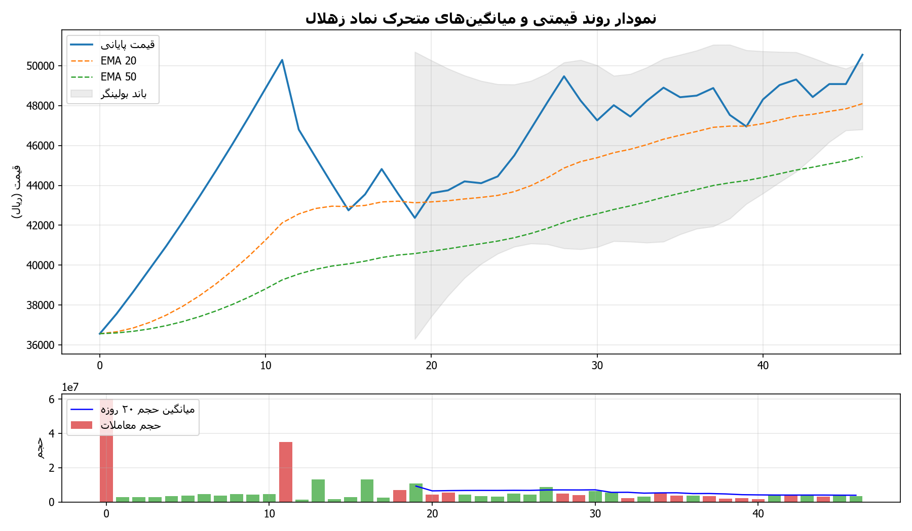
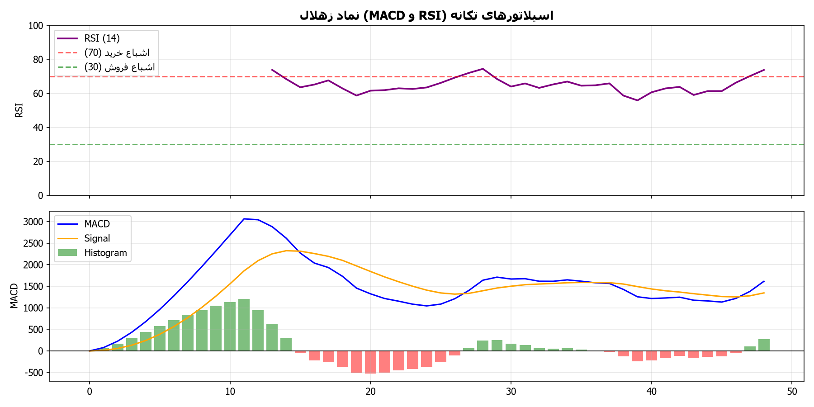
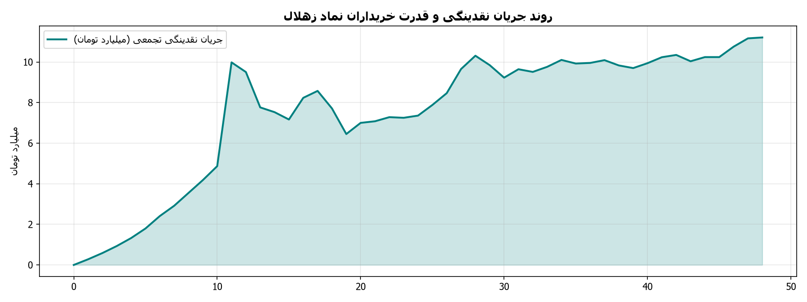

# گزارش تحلیلی جامع تکنیکال و تابلوخوانی نماد زهلال
**تاریخ تحلیل:** 1405/06/07 - 08:45  
**آخرین قیمت معاملاتی:** 49,030 ریال | **دامنه روز:** 48,510 تا 49,460 ریال  
**حجم معاملات آخرین روز:** 4,028,179 برگه سهم (میانگین ۲۰ روزه: 4,052,142)

---

## ۱. تحلیل ساختار روند و امواج (Trend Structure & Wave Patterns)
- **وضعیت کلی روند:** 🟢 صعودی - صعودی تثبیت‌شده (قیمت بالاتر از میانگین‌های کوتاه و میان‌مدت قرار دارد)
- **سقف ماژور دوره (Swing High):** 50,890 ریال
- **کف ماژور دوره (Swing Low):** 35,002 ریال
- **دامنه نوسان واقعی (ATR 14):** 1,822 ریال

### جدول میانگین‌های متحرک نمایی (Exponential Moving Averages)
| شاخص میانگین | مقدار عددی (ریال) | فاصله با قیمت فعلی | موقعیت تکنیکال |
| :--- | :--- | :--- | :--- |
| **EMA 20** | 47,280 | +3.7% | حمایت پویا |
| **EMA 50** | 44,583 | +10.0% | حمایت میان‌مدت |
| **EMA 100** | 41,884 | +17.1% | حمایت / مقاومت تراز میانی |
| **EMA 200** | 39,682 | +23.6% | مرز روند بلندمدت و استراتژیک |

### وضعیت باندهای بولینگر (Bollinger Bands)
- **باند بالایی (Upper Band):** 50,694 ریال
- **باند میانی (SMA 20):** 47,424 ریال
- **باند پایینی (Lower Band):** 44,153 ریال
- **عرض باند (Bandwidth):** 13.8% (سنجش میزان فشردگی نوسانات)

---

## ۲. تحلیل سیستم معاملاتی ایچیموکو (Ichimoku Kinko Hyo)
- **خط تنکان‌سن (Tenkan-sen 9):** 47,905 ریال
- **خط کیجون‌سن (Kijun-sen 26):** 46,185 ریال
- **ابر کومو اسپن A (Senkou Span A):** 49,030 ریال
- **ابر کومو اسپن B (Senkou Span B):** 49,030 ریال
- **ارزیابی تقاطع خطوط:** تنکان‌سن بالای کیجون‌سن (سیگنال تقاطع صعودی TK Cross)
- **موقعیت قیمت نسبت به ابر کومو:** قیمت درون ابر کومو نوسان می‌کند (فاز تعادلی، خنثی و عدم قطعیت جهت حرکت)

---

## ۳. اسیلاتورهای تکانه و واگرایی‌ها (Momentum Oscillators & Divergences)
- **شاخص قدرت نسبی (RSI 14):** **63.0** (تکانه مثبت و برتری نسبی خریداران)
- **مکدی (MACD 12,26,9):** 1229.18 | **خط سیگنال:** 1396.01 | **هیستوگرام:** -166.84

### بررسی وضعیت واگرایی‌های تکنیکال (Divergence Analysis)
- **واگرایی در اسیلاتور RSI:** تشکیل واگرایی منفی معمولی (RD-) در سقف‌های قیمتی (هشدار ضعف مومنتوم خریداران).
- **واگرایی در اندیکاتور MACD:** تشکیل واگرایی منفی مکدی (کاهش انرژی تقاضا در قله‌های قیمتی).

---

## ۴. ترازهای فیبوناچی (Fibonacci Retracement & Expansion Levels)
مبنای محاسبه ترازهای فیبوناچی اصلاحی بر اساس آخرین موج حرکتی بین کف 35,002 و سقف 50,890 ریال:

| نسبت فیبوناچی | سطح قیمتی (ریال) | فاصله با قیمت فعلی | نقش تکنیکال |
| :--- | :--- | :--- | :--- |
| **0.0** | 50,890 | -3.7% | سقف موج (Pivot High) |
| **0.236** | 47,140 | +4.0% | حمایت / مقاومت اول اصلاحی (23.6%) |
| **0.382** | 44,821 | +9.4% | تراز اصلاحی نرمال (38.2%) |
| **0.5** | 42,946 | +14.2% | تراز میانی تعادلی (50.0%) |
| **0.618** | 41,071 | +19.4% | تراز طلایی و پرتقاضا (61.8%) |
| **0.786** | 38,402 | +27.7% | آخرین سد دفاعی روند (78.6%) |
| **1.0** | 35,002 | +40.1% | کف موج (Pivot Low) |

- **نزدیک‌ترین سطح حمایت معتبر:** **47,140 ریال**
- **نزدیک‌ترین سطح مقاومت معتبر:** **50,890 ریال**

---

## ۵. تابلوخوانی و رفتارشناسی حقیقی/حقوقی (Tape Reading & Smart Money Flow)
- **نسبت قدرت خریدار به فروشنده:** **24.61** (قدرت خریدار بسیار عالی (ورود پول هوشمند و خرید قدرتمند توسط کدهای درشت حقیقی))
- **سرانه خرید حقیقی:** 6,392 سهم | **سرانه فروش حقیقی:** 260 سهم
- **حجم خرید حقیقی:** 3,540,964 سهم | **حجم خرید حقوقی:** 487,215 سهم
- **حجم فروش حقیقی:** 3,234,870 سهم | **حجم فروش حقوقی:** 793,309 سهم
- **وضعیت حجم معاملات:** حجم معاملات در محدوده نرمال و نزدیک به میانگین دوره‌ای

---

## ۶. نمودارهای تحلیل تکنیکال و بصری
- 
- 
- 

---
*نویسنده و توسعه دهنده: alimohammadzadeh@ut.ac.ir*