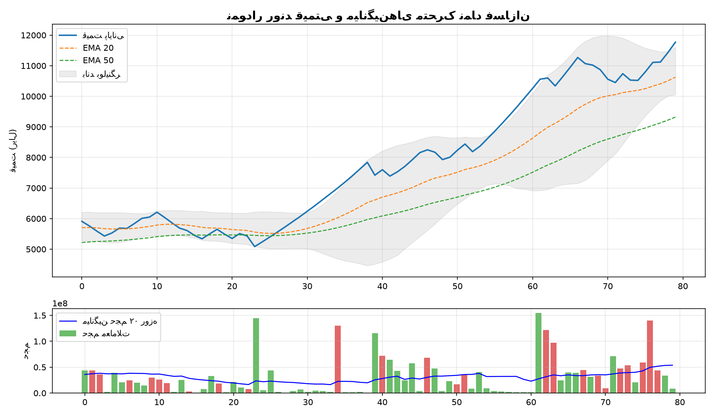
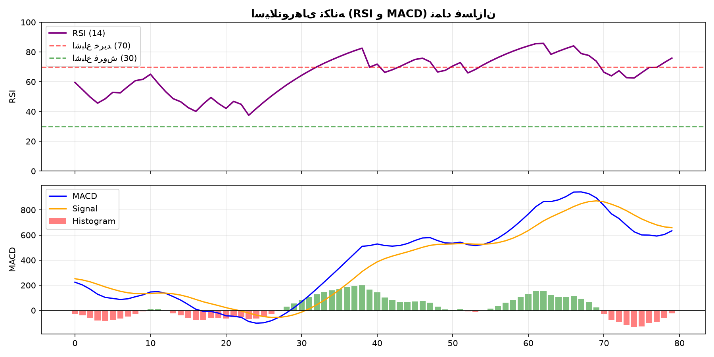
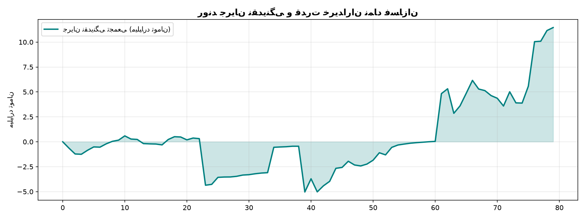

# گزارش تحلیلی جامع تکنیکال و تابلوخوانی نماد فسازان
**تاریخ تحلیل:** 1405/06/05 - 21:21  
**آخرین قیمت معاملاتی:** 11,770 ریال | **دامنه روز:** 11,770 تا 11,770 ریال  
**حجم معاملات آخرین روز:** 8,608,899 برگه سهم (میانگین ۲۰ روزه: 53,759,500)

---

## ۱. تحلیل ساختار روند و امواج (Trend Structure & Wave Patterns)
- **وضعیت کلی روند:** 🟢 صعودی - صعودی تثبیت‌شده (قیمت بالاتر از میانگین‌های کوتاه و میان‌مدت قرار دارد)
- **سقف ماژور دوره (Swing High):** 11,770 ریال
- **کف ماژور دوره (Swing Low):** 4,024 ریال
- **دامنه نوسان واقعی (ATR 14):** 449 ریال

### جدول میانگین‌های متحرک نمایی (Exponential Moving Averages)
| شاخص میانگین | مقدار عددی (ریال) | فاصله با قیمت فعلی | موقعیت تکنیکال |
| :--- | :--- | :--- | :--- |
| **EMA 20** | 10,626 | +10.8% | حمایت پویا |
| **EMA 50** | 9,320 | +26.3% | حمایت میان‌مدت |
| **EMA 100** | 7,902 | +48.9% | حمایت / مقاومت تراز میانی |
| **EMA 200** | 6,477 | +81.7% | مرز روند بلندمدت و استراتژیک |

### وضعیت باندهای بولینگر (Bollinger Bands)
- **باند بالایی (Upper Band):** 11,605 ریال
- **باند میانی (SMA 20):** 10,830 ریال
- **باند پایینی (Lower Band):** 10,056 ریال
- **عرض باند (Bandwidth):** 14.3% (سنجش میزان فشردگی نوسانات)

---

## ۲. تحلیل سیستم معاملاتی ایچیموکو (Ichimoku Kinko Hyo)
- **خط تنکان‌سن (Tenkan-sen 9):** 11,000 ریال
- **خط کیجون‌سن (Kijun-sen 26):** 10,195 ریال
- **ابر کومو اسپن A (Senkou Span A):** 7,642 ریال
- **ابر کومو اسپن B (Senkou Span B):** 6,770 ریال
- **ارزیابی تقاطع خطوط:** تنکان‌سن بالای کیجون‌سن (سیگنال تقاطع صعودی TK Cross)
- **موقعیت قیمت نسبت به ابر کومو:** قیمت بالای ابر کومو قرار دارد (موقعیت روند صعودی پرقدرت و حمایت ابر کومو)

---

## ۳. اسیلاتورهای تکانه و واگرایی‌ها (Momentum Oscillators & Divergences)
- **شاخص قدرت نسبی (RSI 14):** **75.9** (اشباع خرید (احتمال شناسایی سود یا استراحت موقت روند))
- **مکدی (MACD 12,26,9):** 634.39 | **خط سیگنال:** 659.24 | **هیستوگرام:** -24.85

### بررسی وضعیت واگرایی‌های تکنیکال (Divergence Analysis)
- **واگرایی در اسیلاتور RSI:** واگرایی واضحی در اسیلاتور RSI مشاهده نشده و تکانه همگام با نوسانات قیمت است.
- **واگرایی در اندیکاتور MACD:** هیستوگرام و خط مکدی در تعادل با رفتار روند قیمتی نوسان می‌کنند.

---

## ۴. ترازهای فیبوناچی (Fibonacci Retracement & Expansion Levels)
مبنای محاسبه ترازهای فیبوناچی اصلاحی بر اساس آخرین موج حرکتی بین کف 4,024 و سقف 11,770 ریال:

| نسبت فیبوناچی | سطح قیمتی (ریال) | فاصله با قیمت فعلی | نقش تکنیکال |
| :--- | :--- | :--- | :--- |
| **0.0** | 11,770 | +0.0% | سقف موج (Pivot High) |
| **0.236** | 9,942 | +18.4% | حمایت / مقاومت اول اصلاحی (23.6%) |
| **0.382** | 8,811 | +33.6% | تراز اصلاحی نرمال (38.2%) |
| **0.5** | 7,897 | +49.0% | تراز میانی تعادلی (50.0%) |
| **0.618** | 6,983 | +68.6% | تراز طلایی و پرتقاضا (61.8%) |
| **0.786** | 5,682 | +107.2% | آخرین سد دفاعی روند (78.6%) |
| **1.0** | 4,024 | +192.5% | کف موج (Pivot Low) |

- **نزدیک‌ترین سطح حمایت معتبر:** **9,942 ریال**
- **نزدیک‌ترین سطح مقاومت معتبر:** **11,770 ریال**

---

## ۵. تابلوخوانی و رفتارشناسی حقیقی/حقوقی (Tape Reading & Smart Money Flow)
- **نسبت قدرت خریدار به فروشنده:** **1.37** (برتری خریداران حقیقی بر فروشندگان)
- **سرانه خرید حقیقی:** 39,417 سهم | **سرانه فروش حقیقی:** 28,825 سهم
- **حجم خرید حقیقی:** 4,808,899 سهم | **حجم خرید حقوقی:** 3,800,000 سهم
- **حجم فروش حقیقی:** 4,986,789 سهم | **حجم فروش حقوقی:** 3,622,110 سهم
- **وضعیت حجم معاملات:** حجم معاملات در محدوده نرمال و نزدیک به میانگین دوره‌ای

---

## ۶. نمودارهای تحلیل تکنیکال و بصری
- 
- 
- 

---
*نویسنده و توسعه دهنده: alimohammadzadeh@ut.ac.ir*