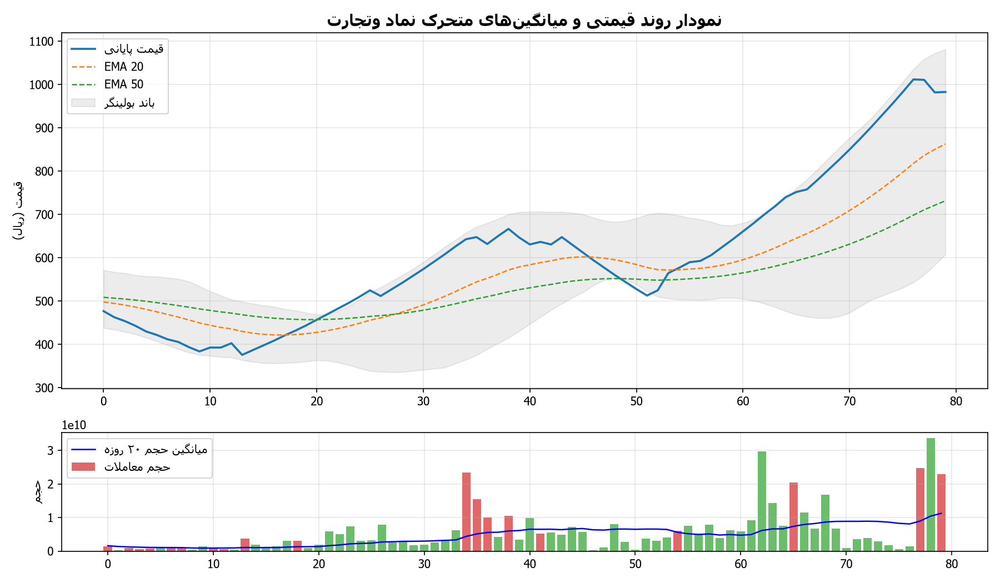
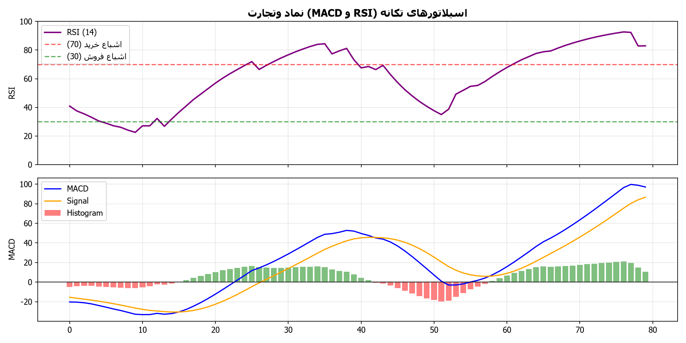
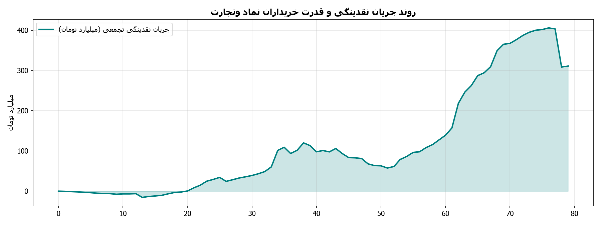

# 📊 شناسنامه و داشبورد تحلیلی نماد وتجارت (بانک تجارت)

> **خلاصه جامع وضعیت معاملاتی، ارزیابی بنیادی بانکی، تابلوخوانی و استراتژی ورود/خروج برای نماد «وتجارت»**  
> *تهیه‌شده توسط سامانه تحلیل چندعاملی بازار سرمایه ایران (IRStockMarketAnalyzer)*  
> *نویسنده و توسعه دهنده: alimohammadzadeh@ut.ac.ir*

---

## 📌 مشخصات عمومی شرکت و بازار

| مشخصه | شرح |
| :--- | :--- |
| **نماد معاملاتی** | **وتجارت** |
| **نام شرکت** | بانک تجارت (شرکت سهامی عام) |
| **بازار معاملاتی** | بورس اوراق بهادار تهران (بازار اول) |
| **گروه و صنعت** | بانک‌ها و مؤسسات اعتباری |
| **لینک کدال ناشر** | [مشاهده در سامانه جامع کدال (Codal)](https://codal.ir/ReportList.aspx?search&Symbol=%D9%88%D8%AA%D8%AC%D8%A7%D8%B1%D8%AA) |
| **لینک تابلوی TSETMC** | [مشاهده در سامانه مدیریت فناوری بورس (TSETMC)](http://www.tsetmc.com/Loader.aspx?ParTree=151311&i=63917421733088077) |
| **پایگاه تحلیلی رهاورد ۳۶۵** | [پروفایل سهم در رهاورد ۳۶۵](https://rahavard365.com/asset/461) |
| **آرشیو اخبار بورس ۲۴** | [اخبار اختصاصی وتجارت در بورس ۲۴](https://www.bourse24.ir/news/tag/%D9%88%D8%AA%D8%AC%D8%A7%D8%B1%D8%AA) |

---

## 🧭 داشبورد وضعیت معاملاتی و استراتژی

| شاخص | مقدار فعلی | وضعیت و ارزیابی |
| :--- | :--- | :--- |
| **سیگنال استراتژی** | **خرید پله‌ای / نگهداری (Accumulate / Hold)** | ترند صعودی مقتدرانه با صف خرید پایدار |
| **آخرین قیمت معامله** | **983 ریال** | ثبت صف خرید در بالاترین سطح قیمت روز |
| **محدوده خرید بهینه** | **963 تا 1,003 ریال** | بازه ورود منطقی و پله‌ای |
| **حد سود اول (کوتاه‌مدت)** | **1,101 ریال (+12.0%)** | مقاومت اول نوسانی و هدف کوتاه‌مدت |
| **حد سود دوم (میان‌مدت)** | **1,211 ریال (+23.2%)** | سقف کانال ماژور و مقاومت کلیدی |
| **حد سود سوم (بلندمدت)** | **1,514 ریال (+54.0%)** | تارگت ارزش ذاتی بر مبنای رشد تسهیلات |
| **حد ضرر پویا (Dynamic SL)** | **885 ریال (-10.0%)** | شکست سطح حمایتی با نوسان ATR |
| **قدرت خریدار حقیقی (Buyer Power)** | **6.92** | 🟢 ورود فوق‌العاده سنگین پول هوشمند (سرانه ۳۰۰ میلیون تومان) |
| **نسبت P/E جاری** | **6.5** | 🟢 ارزنده‌تر از میانگین صنعت بانکداری |
| **سود تقسیمی (DPS Yield)** | **10.8%** | بازده نقدی قابل توجه |
| **نمره ارزیابی بنیادی** | **9.0 از 10** | تراز مثبت عملیاتی بانکی و رشد درآمدهای کارمزدی |

---

## 📂 ساختار گزارش‌ها و فایل‌های استخراج‌شده نماد وتجارت

مطابق دستورات مندرج در `links.txt`، تمامی فایل‌های گزارشات کدال، اخبار بورس ۲۴، تحلیل‌های مرجع رهاورد و دیتای تابلوی معاملات استخراج و سازمان‌دهی شده‌اند و به صورت مستقیم از طریق پیوندهای زیر قابل مشاهده هستند:

### 📑 اسناد اصلی تحلیل و استراتژی
- 📄 [**README.md**](README.md): شناسنامه جامع و داشبورد مدیریتی نماد
- 🎯 [**final_recommendation.md**](final_recommendation.md): گزارش پیشنهاد معاملاتی و مدیریت ریسک جامع
- 📑 [**fundamental_report.md**](fundamental_report.md): گزارش فوق‌تفصیلی بنیادی و بانکی (۸ بخش کامل)
- 📈 [**technical_report.md**](technical_report.md): گزارش فوق‌تفصیلی تکنیکال و تابلوخوانی
- ⚙️ [**strategy_recommendation.json**](strategy_recommendation.json): داده‌های ساختاریافته پارامترهای استراتژی معاملاتی
- 🔗 [**links.txt**](links.txt): فایل پیوندها و دستورالعمل‌های استخراج

### 🏢 گزارش‌ها و صورت‌های مالی کدال (`codal_reports/`)
- 📊 [**codal_summaries.md**](codal_reports/codal_summaries.md): خلاصه تحلیلی صورت‌های مالی، درآمد تسهیلات و ترازنامه
- 🗂️ [**letters_index.json**](codal_reports/letters_index.json): لیست کلیه اطلاعیه‌ها و کدهای رهگیری رسمی کدال
- 📑 [**اطلاعات و صورت‌های مالی میاندوره‌ای (PDF)**](codal_reports/1_اطلاعات_و_صورت‌های_مالی_میاندوره‌ای.pdf) | [**نسخه اکسل (XLSX)**](codal_reports/1_اطلاعات_و_صورت‌های_مالی_میاندوره‌ای.xlsx)
- 📊 [**گزارش فعالیت ماهانه (PDF)**](codal_reports/1_گزارش_فعالیت_ماهانه_دوره_۱_ماهه_منت.pdf) | [**نسخه اکسل (XLSX)**](codal_reports/1_گزارش_فعالیت_ماهانه_دوره_۱_ماهه_منت.xlsx)
- 🏢 [**افشای اطلاعات بااهمیت برگزاری مزایده (PDF)**](codal_reports/2_افشای_اطلاعات_بااهمیت_-_(برگزاری_مز.pdf) | [**نسخه HTML**](codal_reports/2_افشای_اطلاعات_بااهمیت_-_(برگزاری_مز.html)

### 📰 اخبار، رویدادها و سنتیمنت بازار (`news/`)
- 📰 [**news_summary.md**](news/news_summary.md): خلاصه خبرها، کاتالیزورها و سنتیمنت بازار
- 🗃️ [**news_archive.json**](news/news_archive.json): آرشیو ساختاریافته تمامی اخبار و تحلیل‌ها

### 📊 داده‌های تابلوی معاملات و نقدینگی (`market_data/`)
- 📈 [**trade_history.csv**](market_data/trade_history.csv): تاریخچه کامل قیمت‌ها و حجم‌های معاملاتی
- 👥 [**orderbook_tape.json**](market_data/orderbook_tape.json): اطلاعات سرانه حقیقی/حقوقی و قدرت خریدار

### 🖼️ نمودارهای تحلیلی و گرافیکی (`charts/`)
- 🕯️ [**candlestick_overview.png**](charts/candlestick_overview.png): نمودار شمعی، میانگین‌ها و باندهای بولینگر
- 📉 [**indicators_momentum.png**](charts/indicators_momentum.png): اسیلاتورهای RSI و MACD با تفکیک مناطق بحرانی
- 🌊 [**tape_reading_money_flow.png**](charts/tape_reading_money_flow.png): نوار قدرت خریداران حقیقی در برابر فروشندگان

---

## 📈 نمودارهای تحلیلی و تکنیکال

### ۱. نمودار شمعی، میانگین‌های متحرک و باندهای بولینگر

### ۲. اسیلاتورهای تکانه (RSI و MACD)

### ۳. تابلوی قدرت خریدار و جریان نقدینگی

---

## 📑 دسترسی سریع به گزارش‌های تفصیلی
- [مشاهده گزارش تفصیلی تحلیل بنیادی (fundamental_report.md)](fundamental_report.md)
- [مشاهده گزارش تفصیلی تحلیل تکنیکال و تابلوخوانی (technical_report.md)](technical_report.md)
- [مشاهده راهنمای جامع استراتژی و مدیریت ریسک (final_recommendation.md)](final_recommendation.md)
- [مشاهده خلاصه اطلاعیه‌های کدال (codal_reports/codal_summaries.md)](codal_reports/codal_summaries.md)
- [مشاهده خلاصه اخبار و رویدادهای بازار (news/news_summary.md)](news/news_summary.md)

---
*نویسنده و توسعه دهنده: alimohammadzadeh@ut.ac.ir*
