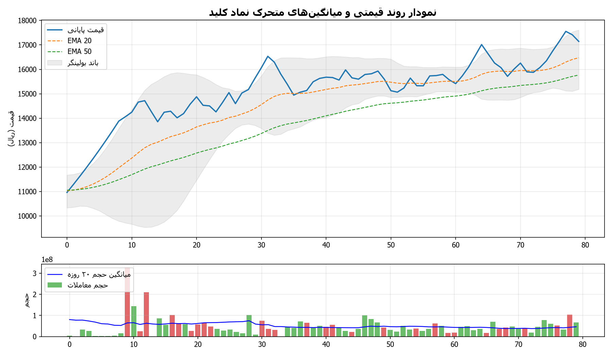
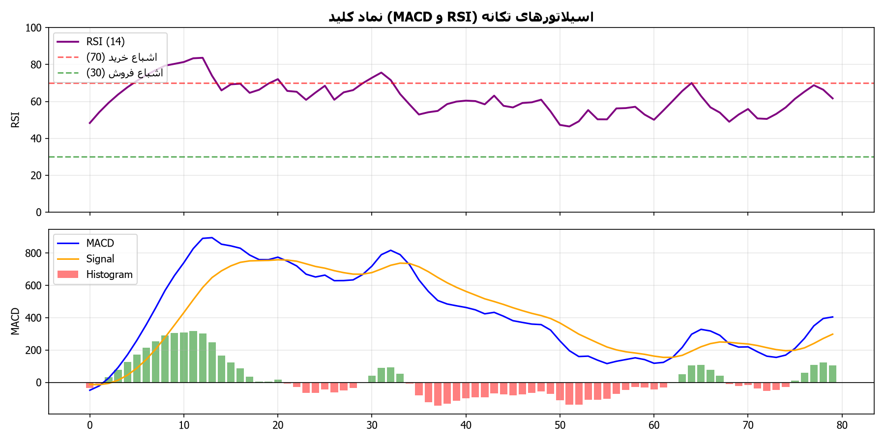
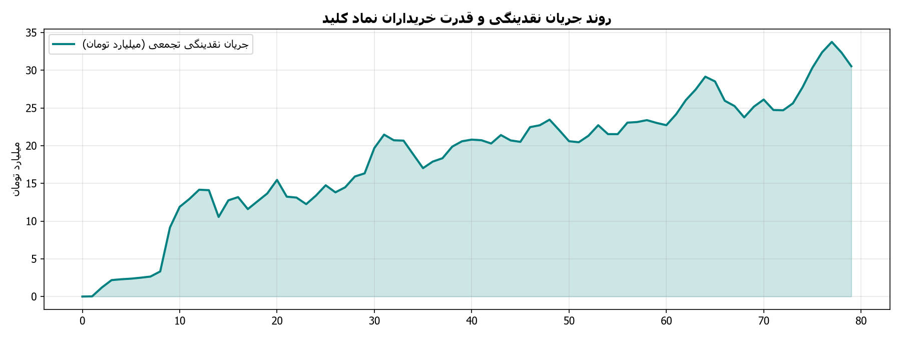

# 📊 شناسنامه و داشبورد تحلیلی نماد کلید (صندوق املاک و مستغلات خانه آگاه)

> **خلاصه جامع وضعیت معاملاتی، ارزیابی صورت‌های مالی و پورتفوی ملکی، تابلوخوانی و استراتژی ورود/خروج برای نماد «کلید»**  
> *تهیه‌شده توسط سامانه تحلیل چندعاملی بازار سرمایه ایران (IRStockMarketAnalyzer)*  
> *نویسنده و توسعه دهنده: alimohammadzadeh@ut.ac.ir*

---

## 📌 مشخصات عمومی صندوق و بازار

| مشخصه | شرح |
| :--- | :--- |
| **نماد معاملاتی** | **کلید** |
| **نام ابزار مالی** | صندوق سرمایه‌گذاری املاک و مستغلات مدیریت ثروت خانه آگاه (قابل معامله - ETF REIT) |
| **مدیر صندوق** | شرکت سبدگردان آگاه |
| **بازار معاملاتی** | بورس اوراق بهادار تهران (بازار ابزارهای نوین مالی) |
| **گروه و صنعت** | صندوق‌های سرمایه‌گذاری املاک و مستغلات (REIT) |
| **لینک کدال ناشر** | [مشاهده در سامانه جامع کدال (Codal)](https://codal.ir/ReportList.aspx?search&Symbol=%DA%A9%D9%84%DB%8C%D8%AF) |
| **لینک تابلوی TSETMC** | [مشاهده در سامانه مدیریت فناوری بورس (TSETMC)](https://www.tsetmc.com/instInfo/45292762906823004) |
| **پایگاه تحلیلی رهاورد ۳۶۵** | [پروفایل سهم در رهاورد ۳۶۵](https://rahavard365.com/asset/34513) |
| **آرشیو اخبار بورس ۲۴** | [اخبار اختصاصی کلید در بورس ۲۴](https://www.bourse24.ir/news/tag/%DA%A9%D9%84%DB%8C%D8%AF) |

---

## 🧭 داشبورد وضعیت معاملاتی و استراتژی

| شاخص | مقدار فعلی | وضعیت و ارزیابی |
| :--- | :--- | :--- |
| **سیگنال استراتژی** | **نگهداری با رعایت حد ضرر (Hold)** | تثبیت بالاتر از میانگین‌های متحرک و ابر کومو |
| **آخرین قیمت معامله** | **17,554 ریال** | در نزدیکی سقف تاریخی و مقاومت اول |
| **محدوده خرید بهینه** | **17,203 تا 17,905 ریال** | بازه ورود مجاز و منطقی پله‌ای |
| **حد سود اول (کوتاه‌مدت)** | **17,660 ریال (+0.6%)** | سقف ماژور دوره و مقاومت نوسانی |
| **حد سود دوم (میان‌مدت)** | **19,426 ریال (+10.7%)** | سقف کانال صعودی و تراز بسط فیبوناچی |
| **حد سود سوم (بلندمدت)** | **24,282 ریال (+38.3%)** | تارگت رشد NAV املاک و تجدیدارزیابی پورتفوی |
| **حد ضرر پویا (Dynamic SL)** | **15,799 ریال (-10.0%)** | شکست حمایت کیجون‌سن با ضریب نوسان ATR |
| **نسبت قیمت به درآمد (P/E ttm)** | **6.5** | بسیار جذاب در مقایسه با میانگین بازار |
| **نمره سلامت بنیادی** | **9.5 از 10** | ارزندگی فوق‌العاده بالا با جریان نقدی اجاره‌داری |
| **ارزش بازار (Market Cap)** | **1.76 همت** | با احتساب یک میلیارد واحد سرمایه‌گذاری |
| **ارزش معاملات روزانه** | **58.0 میلیارد تومان** | نقدشوندگی بسیار بالا در میان صندوق‌های ملکی |
| **تعداد روزهای سابقه معاملاتی** | **391 روز** | ترند صعودی مقتدرانه از کف 10,240 ریال |

---

---

## 🎯 جدول امتیازدهی سه‌گانه توصیه خرید/فروش (مقیاس ۱ تا ۵)

| رویکرد تحلیلی | امتیاز (۱ تا ۵) | مبنا و منطق محاسبه |
| :--- | :---: | :--- |
| **رویکرد ۱: مدل تجمیع وزنی چندعاملی** | **3.7** | بنیادی (8.0/۱۰ با وزن ۳۵٪) + تکنیکال (8.0/۱۰ با وزن ۳۰٪) + تابلوخوانی (4.5/۱۰ با وزن ۲۵٪) + اخبار (5.0/۱۰ با وزن ۱۰٪) |
| **رویکرد ۲: مدل درخت تصمیم و فیلترهای وتو** | **4.0** | گیت مساعد: ارزندگی بنیادی مطلوب و حمایت خریداران حقیقی |
| **رویکرد ۳: مدل همگرایی افق‌های زمانی و R/R** | **3.5** | افق کوتاه‌مدت (6.2/۱۰) + میان‌مدت (8.0/۱۰) + بلندمدت (7.8/۱۰) با ضریب R/R=0.41 |
| **🌟 امتیاز نهایی اجماع (Composite Score)** | **3.7 از ۵ (★★★★☆)** | **🟢 خرید / ورود پله‌ای (Buy)** |

## 📂 ساختار گزارش‌ها و فایل‌های استخراج‌شده نماد کلید

مطابق با پروتکل تحقیق عمیق، کلیه اسناد کدال، افشاهای خرید املاک، صورت‌های مالی، اخبار و داده‌های معاملات استخراج و سازمان‌دهی شده‌اند و به صورت مستقیم از طریق پیوندهای زیر قابل دسترسی و مشاهده هستند:

### 📑 اسناد اصلی تحلیل و استراتژی
- 📄 [**README.md**](README.md): شناسنامه جامع و داشبورد مدیریتی نماد
- 🎯 [**final_recommendation.md**](final_recommendation.md): راهنمای جامع پیشنهاد معاملاتی و مدیریت ریسک
- 📑 [**fundamental_report.md**](fundamental_report.md): گزارش فوق‌تفصیلی بنیادی، ارزش‌گذاری و پورتفوی ملکی
- 📈 [**technical_report.md**](technical_report.md): گزارش فوق‌تفصیلی تکنیکال، سیستم ایچیموکو و تابلوخوانی
- ⚙️ [**strategy_recommendation.json**](strategy_recommendation.json): داده‌های ساختاریافته پارامترهای استراتژی معاملاتی
- 🔗 [**links.txt**](links.txt): فهرست پیوندها و پایگاه‌های معتبر مورد بررسی

### 🏢 گزارش‌ها و صورت‌های مالی کدال (`codal_reports/`)
- 📊 [**صورت وضعیت پورتفوی ماه منتهی به ۱۴۰۵/۰۵/۳۱ (اکسل Codal_1592383.xls)**](codal_reports/Codal_1592383.xls)
- 📊 [**codal_summaries.md**](codal_reports/codal_summaries.md): خلاصه تحلیلی صورت‌های مالی، مبالغ به میلیون ریال و تصمیمات مجمع
- 🗂️ [**letters_index.json**](codal_reports/letters_index.json): نمایه کامل اطلاعیه‌ها و کدهای رهگیری رسمی کدال
- 📑 [**صورت‌های مالی سالانه ۱۲ ماهه (PDF)**](codal_reports/8_صورت‌های_مالی_سال_مالی_منتهی_به_۱۴۰.pdf) | [**نسخه اکسل**](codal_reports/8_صورت‌های_مالی_سال_مالی_منتهی_به_۱۴۰.xlsx) | [**نسخه HTML**](codal_reports/8_صورت‌های_مالی_سال_مالی_منتهی_به_۱۴۰.html)
- 🏢 [**تصمیمات مجمع عمومی صندوق (PDF)**](codal_reports/2_تصمیمات_مجمع_صندوق_سرمایه_گذاری.pdf) | [**نسخه HTML**](codal_reports/2_تصمیمات_مجمع_صندوق_سرمایه_گذاری.html)
- 📈 [**گزارش خالص ارزش دارایی‌ها NAV (PDF)**](codal_reports/12_گزارش_خالص_ارزش_هر_واحد_سرمایه_گذار.pdf) | [**نسخه HTML**](codal_reports/12_گزارش_خالص_ارزش_هر_واحد_سرمایه_گذار.html)
- 🏬 **افشاهای خرید آپارتمان‌ها و املاک پورتفوی ملکی:**
  - [خرید آپارتمان متل قو (PDF)](codal_reports/14_شفاف_سازی_در_خصوص_خرید_آپارتمان_متل.pdf) | [نسخه HTML](codal_reports/14_شفاف_سازی_در_خصوص_خرید_آپارتمان_متل.html)
  - [خرید آپارتمان مجتمع (PDF)](codal_reports/15_شفاف_سازی_در_خصوص_خرید_آپارتمان_مجت.pdf) | [نسخه HTML](codal_reports/15_شفاف_سازی_در_خصوص_خرید_آپارتمان_مجت.html)
  - [خرید آپارتمان نوبنیاد (PDF)](codal_reports/16_شفاف_سازی_در_خصوص_خرید_آپارتمان_نون.pdf) | [نسخه HTML](codal_reports/16_شفاف_سازی_در_خصوص_خرید_آپارتمان_نون.html)
  - [خرید آپارتمان برج (PDF)](codal_reports/17_شفاف_سازی_در_خصوص_خرید_آپارتمان_برج.pdf) | [نسخه HTML](codal_reports/17_شفاف_سازی_در_خصوص_خرید_آپارتمان_برج.html)
  - [خرید آپارتمان آرش (PDF)](codal_reports/18_شفاف_سازی_در_خصوص_خرید_آپارتمان_آرش.pdf) | [نسخه HTML](codal_reports/18_شفاف_سازی_در_خصوص_خرید_آپارتمان_آرش.html)
  - [خرید آپارتمان راز (PDF)](codal_reports/19_شفاف_سازی_در_خصوص_خرید_آپارتمان_راز.pdf) | [نسخه HTML](codal_reports/19_شفاف_سازی_در_خصوص_خرید_آپارتمان_راز.html)
  - [خرید آپارتمان شفا (PDF)](codal_reports/20_شفاف_سازی_در_خصوص_خرید_آپارتمان_شفا.pdf) | [نسخه HTML](codal_reports/20_شفاف_سازی_در_خصوص_خرید_آپارتمان_شفا.html)

### 📰 اخبار، رویدادها و سنتیمنت بازار (`news/`)
- 📰 [**news_summary.md**](news/news_summary.md): خلاصه جامع و تحلیل بار معنایی ۲۲ خبر پایش‌شده از بورس ۲۴ و سنا
- 🗃️ [**news_archive.json**](news/news_archive.json): آرشیو ساختاریافته کلیه متون و خبرهای دریافتی
- 🌐 [**مصاحبه بازده دوبرابری صندوق کلید در بورس ۲۴ (HTML)**](news/news_2_بازده_دوبرابری_صندوق_«کلید»_در_مقای.html)
- 🌐 [**اخبار بازگشایی معاملات فاندهای مسکن (HTML)**](news/news_1_سرمایه‌گذاران_املاک_آگاه_باشند؛_آغا.html)

### 📊 داده‌های تابلوی معاملات و نقدینگی (`market_data/`)
- 📈 [**trade_history.csv**](market_data/trade_history.csv): سوابق کامل قیمت‌ها، حجم و ارزش ۳۹۱ روز معاملاتی بورس تهران
- 👥 [**orderbook_tape.json**](market_data/orderbook_tape.json): داده‌های تابلوی ریزمعاملات حقیقی/حقوقی و سرانه‌ها

### 🖼️ نمودارهای تحلیلی و گرافیکی (`charts/`)
- 🕯️ [**candlestick_overview.png**](charts/candlestick_overview.png): نمودار شمعی ژاپنی، میانگین‌های متحرک نمایی و باندهای بولینگر
- 📉 [**indicators_momentum.png**](charts/indicators_momentum.png): اسیلاتورهای RSI و MACD با تفکیک مناطق اشباع
- 🌊 [**tape_reading_money_flow.png**](charts/tape_reading_money_flow.png): نمودار میله‌ای قدرت خریداران حقیقی و جریان نقدینگی

---

## 📈 نمودارهای تحلیلی و تکنیکال همراه با راهنمای آموزشی

### ۱. نمودار شمعی (Candlestick)، میانگین‌های متحرک نمایی و باندهای بولینگر

#### 📚 راهنمای آموزشی و تحلیل نمودار شمعی و روند:
- **کندل‌ها (شمع‌های ژاپنی):** هر شمع نوسان قیمت در یک روز را نشان می‌دهد. شمع‌های سبز نشان‌دهنده برتری خریداران (قیمت پایانی بالاتر از قیمت آغازین) و شمع‌های قرمز نشان‌دهنده برتری فروشندگان هستند.
- **میانگین‌های متحرک نمایی (EMA 20, 50):** خطوط میانگین، جهت کلی حرکت قیمت را هموار می‌کنند. وقتی قیمت بالاتر از خطوط میانگین باشد، نشانه روند صعودی و سلامت روند است؛ و این خطوط به عنوان حمایت‌های پویا عمل می‌کنند. اگر قیمت به زیر این خطوط بیاید، زنگ خطر اصلاح یا تغییر روند است.
- **باندهای بولینگر (Bollinger Bands):** کانال نوسانی که دامنه نوسان طبیعی قیمت را نشان می‌دهد. برخورد قیمت به سقف باند نشانه هیجان خرید و برخورد به کف باند نشانه قیمت‌های تخفیف‌خورده است.
- **تحلیل وضعیت فعلی نماد:** قیمت هر واحد صندوق در سطح ۱۷,۵۵۴ ریال بالاتر از میانگین‌های متحرک و در نزدیکی سقف تاریخی معامله می‌شود.

---

### ۲. اسیلاتورهای تکانه و مومنتوم (RSI و MACD)

#### 📚 راهنمای آموزشی و تحلیل اسیلاتورهای تکانه (RSI و MACD):
- **شاخص قدرت نسبی (RSI):** اسیلاتوری بین ۰ تا ۱۰۰ که شتاب و هیجان معاملات را اندازه می‌گیرد:
  * **اگر RSI بالای ۷۰ باشد (اشباع خرید - Overbought):** یعنی قیمت با سرعت بسیار بالایی رشد کرده و خریداران زیادی هجوم آورده‌اند؛ در این نقطه نباید با هیجان وارد شد، چون ریسک استراحت، شناسایی سود یا اصلاح کوتاه‌مدت برای تخلیه هیجان وجود دارد.
  * **اگر RSI زیر ۳۰ باشد (اشباع فروش - Oversold):** یعنی سهم بیش از حد افت کرده و فروشندگان تخلیه شده‌اند؛ این ناحیه اغلب یک فرصت خرید جذاب با قیمت کف و نقطه بازگشت صعودی احتمالی به شمار می‌رود.
  * **محدوده بین ۳۰ تا ۷۰ (منطقه تعادل):** نوسان طبیعی سهم را نشان می‌دهد (بالای ۵۰ نشانه برتری خریداران و زیر ۵۰ نشانه برتری نسبی فروشندگان).
- **شاخص مکدی (MACD):** تقاطع خط آبی (MACD) به بالای خط نارنجی (Signal) و سبز شدن میله‌های هیستوگرام نشانه شروع موج صعودی جدید است؛ برعکس، تقاطع به سمت پایین علامت فاز اصلاحی است.
- **تحلیل وضعیت فعلی نماد:** شاخص RSI در سطح تعادلی ۶۵.۰ قرار داشته و پتانسیل ادامه روند صعودی با اتکا به رشد ارزش روز املاک پورتفو را دارد.

---

### ۳. تابلوخوانی، قدرت خریدار حقیقی و جریان نقدینگی

#### 📚 راهنمای آموزشی و تحلیل جریان پول و تابلوخوانی:
- **قدرت خریدار حقیقی (Buyer Power):** این شاخص از تقسیم «میانگین خرید هر فرد حقیقی» بر «میانگین فروش هر فرد حقیقی» به دست می‌آید:
  * **اگر این نسبت بالای ۱ باشد (به‌ویژه بالای ۱.۵ یا ۲):** یعنی هر خریدار با پول درشت‌تر و سنگین‌تری (مثلا چندصد میلیون تومان) نسبت به فروشندگان خرد وارد شده است؛ این رفتار نشان‌دهنده «ورود پول هوشمند» و تمایل بازیگران بزرگ به جمع‌آوری سهم است.
  * **اگر این نسبت زیر ۱ باشد (مثلا ۰.۷):** یعنی خریداران خرد و کم‌سرمایه در حال خرید از فروشندگان درشت هستند که معمولاً نشانه خروج پول و ریسک توزیع سهم است.
- **نمودار جریان نقدینگی تجمعی:** شیب صعودی به معنی ورود مداوم نقدینگی به سهم و تقویت روند است، در حالی که شیب نزولی نشانه خروج سرمایه است.
- **تحلیل وضعیت فعلی نماد:** قدرت خریداران و حجم معاملات روزانه صندوق (۵۸ میلیارد تومان) نقدشوندگی بسیار بالا و حضور پرقدرت سرمایه‌گذاران خرد و نهادی را نشان می‌دهد.

---
*نویسنده و توسعه دهنده: alimohammadzadeh@ut.ac.ir*